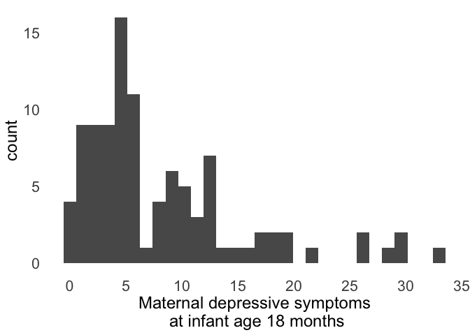

Analyses for *Dimensions of the language environment in infancy and
symptoms of psychopathology in toddlerhood*
================
Lucy S. King
2020

  - [Environment](#environment)
  - [Read in and join data](#read-in-and-join-data)
  - [Calculate income-to-needs based on 200% of federal poverty line
    limits in
    2017](#calculate-income-to-needs-based-on-200-of-federal-poverty-line-limits-in-2017)
  - [Retention / Missing data](#retention-missing-data)
  - [Descriptive statistics](#descriptive-statistics)
      - [IBQ, ITSEA reliability](#ibq-itsea-reliability)
      - [Distributions](#distributions)
      - [Correlations](#correlations)
      - [t-tests by bilingual status](#t-tests-by-bilingual-status)
      - [t-tests by day type](#t-tests-by-day-type)
      - [Histograms](#histograms)
  - [Results](#results)
      - [Associations of LENA measures with ITSEA
        symptoms](#associations-of-lena-measures-with-itsea-symptoms)
      - [Plot associations](#plot-associations)
      - [Infant vocalizations](#infant-vocalizations-1)
      - [Elastic net regression with LENA variables and
        covariates](#elastic-net-regression-with-lena-variables-and-covariates)
      - [Additional analyses](#additional-analyses)
      - [Export data](#export-data)

# Environment

``` r
# Libraries
library(tidyverse)
```

    ## ── Attaching packages ─────────────────────────────────────── tidyverse 1.3.0 ──

    ## ✓ ggplot2 3.3.2     ✓ purrr   0.3.4
    ## ✓ tibble  3.0.4     ✓ dplyr   1.0.2
    ## ✓ tidyr   1.1.2     ✓ stringr 1.4.0
    ## ✓ readr   1.4.0     ✓ forcats 0.5.0

    ## ── Conflicts ────────────────────────────────────────── tidyverse_conflicts() ──
    ## x dplyr::filter() masks stats::filter()
    ## x dplyr::lag()    masks stats::lag()

``` r
library(lubridate)
```

    ## 
    ## Attaching package: 'lubridate'

    ## The following objects are masked from 'package:base':
    ## 
    ##     date, intersect, setdiff, union

``` r
library(corrr)
library(corrplot)
```

    ## corrplot 0.84 loaded

``` r
library(ggpubr)
library(modelr)
library(effectsize)
library(glmpath)
```

    ## Loading required package: survival

``` r
library(glmnet)
```

    ## Loading required package: Matrix

    ## 
    ## Attaching package: 'Matrix'

    ## The following objects are masked from 'package:tidyr':
    ## 
    ##     expand, pack, unpack

    ## Loaded glmnet 4.0-2

``` r
library(MASS)
```

    ## 
    ## Attaching package: 'MASS'

    ## The following object is masked from 'package:dplyr':
    ## 
    ##     select

``` r
library(ggcorrplot)
library(broom)
```

    ## 
    ## Attaching package: 'broom'

    ## The following object is masked from 'package:modelr':
    ## 
    ##     bootstrap

``` r
library(ggfortify)
library(relaimpo)
```

    ## Loading required package: boot

    ## 
    ## Attaching package: 'boot'

    ## The following object is masked from 'package:survival':
    ## 
    ##     aml

    ## Loading required package: survey

    ## Loading required package: grid

    ## 
    ## Attaching package: 'survey'

    ## The following object is masked from 'package:graphics':
    ## 
    ##     dotchart

    ## Loading required package: mitools

    ## This is the global version of package relaimpo.

    ## If you are a non-US user, a version with the interesting additional metric pmvd is available

    ## from Ulrike Groempings web site at prof.beuth-hochschule.de/groemping.

``` r
library(olsrr)
```

    ## 
    ## Attaching package: 'olsrr'

    ## The following object is masked from 'package:MASS':
    ## 
    ##     cement

    ## The following object is masked from 'package:datasets':
    ## 
    ##     rivers

``` r
library(parameters)
library(BayesFactor)
```

    ## Loading required package: coda

    ## ************
    ## Welcome to BayesFactor 0.9.12-4.2. If you have questions, please contact Richard Morey (richarddmorey@gmail.com).
    ## 
    ## Type BFManual() to open the manual.
    ## ************

``` r
library(codebook)
library(labelled)
```

    ## 
    ## Attaching package: 'labelled'

    ## The following object is masked from 'package:codebook':
    ## 
    ##     to_factor

``` r
# Files 
home <- "~/Box/Mooddata_Coordinating/BABIES/Data/final_scored_data/"

eligible_id_file <- "~/Box/lucy_king_files/BABIES/lena_symptoms/inclusion_tracker_sub2.xlsx"
lena_edited_file <- "~/Box/lucy_king_files/BABIES/lena_symptoms/included_recording_dates.csv"
fp_intervention_id <- paste0(home, "lab_caregiving_behavior/free_play_intervention_assignment.csv")
itsea_file <- paste0(home, "survey_18month/itsea_scored_20201001.csv")
demographics_file <- paste0(home, "demographics/demo_6mo_cleaned_final.csv")
lena_file <- paste0(home, "LENA/lena_final_wf_day1_20200208_upto9months.csv")
ibq_file <- paste0(home, "IBQ/ibq_scored_final.csv")
sfp_care_file <- paste0(home, "lab_caregiving_behavior/PCIRS_sfp_wf_complete.csv")
fp_care_file <- paste0(home, "lab_caregiving_behavior/free_play_wf_8min_20200507.csv")
cesd_file <- paste0(home, "CESD/cesd_wf_20201001.csv")

# Functions
source("identify_outliers_histogram.R")

theme_lena <-
  theme_minimal() +
  theme(
    panel.grid = element_blank(),
    plot.title = element_text(size = 18, hjust = .5),
    axis.title = element_text(size = 18),
    axis.text = element_text(size = 16),
    legend.title = element_text(size = 18), 
    legend.text = element_text(size = 16),
    legend.position = "bottom"
  )

# Display options
options(scipen = 999)
```

# Read in and join data

``` r
d0 <-
  readxl::read_xlsx(eligible_id_file, sheet = "data_filtered_T3") %>% 
  dplyr::select(
    ID,
    eligible,
    included
  ) %>% 
  filter(included == 1) %>% 
  left_join(
    read_csv(lena_edited_file) %>% 
      dplyr::select(
        ID, LENA_edited
      ),
    by = "ID"
  ) %>% 
  left_join(
    read_csv(demographics_file) %>% 
      dplyr::select(
        ID,
        baby_dob,
        education,
        education_txt,
        annual_income_txt,
        income_numeric = annual_income_num,
        ppl_in_home_total = ppl_in_home_tot,
        ppl_in_home_allchild,
        income_needs,
        male,
        mom_age,
        mom_latinx,
        mom_race,
        age_behav,
        secondlang,
        secondlang_type
      ),
    by = "ID"
  ) %>% 
  left_join(
    read_csv(itsea_file) %>% 
      dplyr::select(
        ID,
        survey_date,
        itsea_symptoms,
        itsea_activity,
        itsea_agress,
        itsea_gad,
        itsea_negemo,
        itsea_depp,
        itsea_intern,
        itsea_extern,
        # itsea symptoms items
        itsea_a2, 
        itsea_a4, 
        itsea_b8, 
        itsea_b10, 
        itsea_b27, 
        itsea_b32,
        itsea_a28, 
        itsea_a30, 
        itsea_a33, 
        itsea_b3, 
        itsea_b9, 
        itsea_b16, 
        itsea_b30, 
        itsea_b34, 
        itsea_b44, 
        itsea_b88, 
        itsea_c2, 
        itsea_e4,
        itsea_a9, 
        itsea_a39, 
        itsea_a40, 
        itsea_b43, 
        itsea_b76, 
        itsea_b81, 
        itsea_b84, 
        itsea_b91, 
        itsea_b92,
        itsea_a3, 
        itsea_a12, 
        itsea_a35, 
        itsea_b37, 
        itsea_b70, 
        itsea_b86, 
        itsea_e5, 
        itsea_e6, 
        itsea_e11,
        itsea_a7, 
        itsea_a21, 
        itsea_a23, 
        itsea_b31, 
        itsea_b45, 
        itsea_b50, 
        itsea_b53, 
        itsea_b59, 
        itsea_b65, 
        itsea_b66, 
        itsea_b74, 
        itsea_b80, 
        itsea_b85,
        itsea_concern_ied
      ), 
    by = "ID"
  ) %>% 
  mutate(
    survey_date =  parse_date_time(survey_date, orders = c("mdy HM")),
    age_18mo = (baby_dob %--% survey_date) / months(1)
  ) %>% 
  left_join(
    read_csv(fp_care_file) %>% 
      dplyr::select(ID, negmood_FP, sens_FP),
    by = "ID"
  ) %>% 
  left_join(
    read_csv(sfp_care_file) %>% 
      dplyr::select(ID, sens_R_M, sens_M),
    by = "ID"
  ) %>% 
  left_join(
    read_csv(ibq_file) %>% 
      dplyr::select(
        ID,
        #IBQ NEG items
        ibq_64, ibq_74, ibq_75, ibq_32, ibq_79, ibq_80,
        ibq_2, ibq_3_r, ibq_4, ibq_21, ibq_52, ibq_53, ibq_62,
        ibq_22, ibq_76, ibq_77, ibq_78, ibq_87, ibq_89,
        ibq_36, ibq_37, ibq_38, ibq_63, ibq_71, ibq_72,
        NEG
      ),
    by = "ID"
  ) %>% 
  left_join(read_csv(lena_file), by = "ID") %>% 
  left_join(read_csv(cesd_file), by = "ID") %>% 
  left_join(read_csv(fp_intervention_id), by = "ID") %>% 
  rename(
    age_lena_d1 = age,
    sens_r_sfp = sens_R_M,
    sens_sfp = sens_M,
    sens_fp = sens_FP,
    negmood_fp = negmood_FP
  ) 
```

    ## 
    ## ── Column specification ────────────────────────────────────────────────────────
    ## cols(
    ##   ID = col_double(),
    ##   date_record = col_character(),
    ##   LENA_edited = col_double()
    ## )

    ## 
    ## ── Column specification ────────────────────────────────────────────────────────
    ## cols(
    ##   .default = col_double(),
    ##   due_date = col_datetime(format = ""),
    ##   baby_dob = col_datetime(format = ""),
    ##   mom_dob = col_datetime(format = ""),
    ##   baby_race = col_character(),
    ##   baby_race_describe = col_character(),
    ##   mom_race = col_character(),
    ##   momrace_describe = col_character(),
    ##   annual_income_txt = col_character(),
    ##   education_txt = col_character(),
    ##   employment_status_txt = col_character(),
    ##   marital_status_txt = col_character(),
    ##   partner_educ_txt = col_character(),
    ##   partner_employ_txt = col_character(),
    ##   questionnaire_only_date = col_date(format = ""),
    ##   educ_describe = col_logical(),
    ##   employment_explain = col_character(),
    ##   mom_pob = col_character(),
    ##   mom_native_lang = col_character(),
    ##   primarylang = col_character(),
    ##   secondlang_type = col_character()
    ##   # ... with 24 more columns
    ## )
    ## ℹ Use `spec()` for the full column specifications.

    ## 
    ## ── Column specification ────────────────────────────────────────────────────────
    ## cols(
    ##   .default = col_double(),
    ##   survey_date = col_character(),
    ##   baby_dob = col_datetime(format = ""),
    ##   activity_concern = col_character(),
    ##   agress_concern = col_character(),
    ##   depp_concern = col_character(),
    ##   gad_concern = col_character(),
    ##   negemo_concern = col_character(),
    ##   play_concern = col_character(),
    ##   empathy_concern = col_character(),
    ##   social_concern = col_character(),
    ##   itsea_concern = col_character(),
    ##   itsea_concern_ied = col_character()
    ## )
    ## ℹ Use `spec()` for the full column specifications.

    ## 
    ## ── Column specification ────────────────────────────────────────────────────────
    ## cols(
    ##   ID = col_double(),
    ##   sens_FP = col_double(),
    ##   intrus_FP = col_double(),
    ##   posreg_FP = col_double(),
    ##   stim_FP = col_double(),
    ##   negreg_FP = col_double(),
    ##   negmood_FP = col_double(),
    ##   posmood_FP = col_double(),
    ##   detach_FP = col_double()
    ## )

    ## 
    ## ── Column specification ────────────────────────────────────────────────────────
    ## cols(
    ##   .default = col_double()
    ## )
    ## ℹ Use `spec()` for the full column specifications.

    ## 
    ## ── Column specification ────────────────────────────────────────────────────────
    ## cols(
    ##   .default = col_double(),
    ##   ibq_timestamp = col_datetime(format = "")
    ## )
    ## ℹ Use `spec()` for the full column specifications.

    ## 
    ## ── Column specification ────────────────────────────────────────────────────────
    ## cols(
    ##   .default = col_double(),
    ##   date_record = col_date(format = ""),
    ##   day_type = col_character(),
    ##   lena_recordno = col_character(),
    ##   lena_probyes = col_character(),
    ##   other_caregiver = col_character(),
    ##   lena_notes = col_character()
    ## )
    ## ℹ Use `spec()` for the full column specifications.

    ## 
    ## ── Column specification ────────────────────────────────────────────────────────
    ## cols(
    ##   ID = col_double(),
    ##   cesd_t1 = col_double(),
    ##   cesd_t2 = col_double(),
    ##   cesd_t3 = col_double(),
    ##   cesd_t4 = col_double(),
    ##   cesd_t1_concern = col_character(),
    ##   cesd_t2_concern = col_character(),
    ##   cesd_t3_concern = col_character(),
    ##   cesd_t4_concern = col_character()
    ## )

    ## 
    ## ── Column specification ────────────────────────────────────────────────────────
    ## cols(
    ##   ID = col_double(),
    ##   group = col_character()
    ## )

# Calculate income-to-needs based on 200% of federal poverty line limits in 2017

``` r
d0 <-
  d0 %>% 
  group_by(ID) %>% 
  mutate(
    # inr based on the federal poverty thresholds for number of people in household and number that are children
    fpl_threshold = case_when(
      ppl_in_home_total == 2 ~ 16493,
      ppl_in_home_total == 3 ~ 19515,
      ppl_in_home_total == 4 ~ 25094,
      ppl_in_home_total == 5 ~ 29714,
      ppl_in_home_total == 6 ~ 33618,
      ppl_in_home_total == 7 ~ 38173,
      ppl_in_home_total == 8 ~ 42684,
      ppl_in_home_total >= 9 ~ 50681
    ),
    inr_fpl = income_numeric / fpl_threshold,
    fpl_low_income = inr_fpl < 1
  ) %>% 
  ungroup()
```

# Retention / Missing data

Dyads who completed the 6-month assessment (either lab or home
observation), were eligible for the 18-month assessment (i.e., were age
18 months by the time of analysis), and completed the 18-month
assessment are included in the current analyses.

``` r
#missing SFP
d0 %>% 
  count(is.na(sens_sfp))
```

    ## # A tibble: 2 x 2
    ##   `is.na(sens_sfp)`     n
    ##   <lgl>             <int>
    ## 1 FALSE                94
    ## 2 TRUE                  6

``` r
#missing FP
d0 %>% 
  count(is.na(sens_fp))
```

    ## # A tibble: 2 x 2
    ##   `is.na(sens_fp)`     n
    ##   <lgl>            <int>
    ## 1 FALSE               96
    ## 2 TRUE                 4

``` r
#missing IBQ
d0 %>% 
  count(is.na(NEG))
```

    ## # A tibble: 2 x 2
    ##   `is.na(NEG)`     n
    ##   <lgl>        <int>
    ## 1 FALSE           96
    ## 2 TRUE             4

``` r
d0 %>% 
  dplyr::select(
    awc_prop, 
    ctc_prop,
    awc_hour_max,
    ctc_hour_max,
    sens_r_sfp,
    sens_fp,
    NEG,
    cesd_t4,
    itsea_symptoms
  ) %>% 
  pair_n()
```

    ##                awc_prop ctc_prop awc_hour_max ctc_hour_max sens_r_sfp sens_fp
    ## awc_prop            100      100          100          100         94      96
    ## ctc_prop            100      100          100          100         94      96
    ## awc_hour_max        100      100          100          100         94      96
    ## ctc_hour_max        100      100          100          100         94      96
    ## sens_r_sfp           94       94           94           94         94      93
    ## sens_fp              96       96           96           96         93      96
    ## NEG                  96       96           96           96         90      92
    ## cesd_t4             100      100          100          100         94      96
    ## itsea_symptoms      100      100          100          100         94      96
    ##                NEG cesd_t4 itsea_symptoms
    ## awc_prop        96     100            100
    ## ctc_prop        96     100            100
    ## awc_hour_max    96     100            100
    ## ctc_hour_max    96     100            100
    ## sens_r_sfp      90      94             94
    ## sens_fp         92      96             96
    ## NEG             96      96             96
    ## cesd_t4         96     100            100
    ## itsea_symptoms  96     100            100
    ## attr(,"class")
    ## [1] "n_mat"  "matrix"

# Descriptive statistics

## IBQ, ITSEA reliability

``` r
d0 %>% 
  dplyr::select(ibq_64:ibq_72) %>% 
  psych::alpha(check.keys = TRUE)
```

    ## Warning in psych::alpha(., check.keys = TRUE): Some items were negatively correlated with total scale and were automatically reversed.
    ##  This is indicated by a negative sign for the variable name.

    ## 
    ## Reliability analysis   
    ## Call: psych::alpha(x = ., check.keys = TRUE)
    ## 
    ##   raw_alpha std.alpha G6(smc) average_r S/N   ase mean   sd median_r
    ##       0.87      0.88    0.95      0.22 7.2 0.018  3.2 0.77      0.2
    ## 
    ##  lower alpha upper     95% confidence boundaries
    ## 0.84 0.87 0.91 
    ## 
    ##  Reliability if an item is dropped:
    ##         raw_alpha std.alpha G6(smc) average_r S/N alpha se var.r med.r
    ## ibq_64       0.87      0.87    0.94      0.23 7.0    0.019 0.025  0.20
    ## ibq_74       0.87      0.87    0.94      0.23 7.0    0.019 0.025  0.20
    ## ibq_75       0.87      0.87    0.94      0.23 7.0    0.019 0.025  0.20
    ## ibq_32       0.87      0.88    0.94      0.23 7.1    0.019 0.025  0.21
    ## ibq_79       0.87      0.88    0.94      0.23 7.2    0.018 0.024  0.21
    ## ibq_80       0.87      0.88    0.94      0.23 7.0    0.019 0.025  0.21
    ## ibq_2        0.86      0.87    0.94      0.22 6.6    0.020 0.024  0.20
    ## ibq_3_r      0.86      0.87    0.94      0.21 6.5    0.020 0.024  0.19
    ## ibq_4        0.87      0.87    0.94      0.22 6.9    0.019 0.024  0.20
    ## ibq_21       0.87      0.87    0.94      0.22 6.9    0.019 0.026  0.20
    ## ibq_52       0.87      0.88    0.94      0.23 7.1    0.018 0.025  0.21
    ## ibq_53       0.87      0.87    0.94      0.22 6.8    0.019 0.025  0.20
    ## ibq_62       0.87      0.87    0.94      0.22 6.9    0.019 0.025  0.20
    ## ibq_22       0.87      0.88    0.95      0.23 7.2    0.018 0.025  0.21
    ## ibq_76       0.87      0.87    0.94      0.22 6.9    0.019 0.023  0.20
    ## ibq_77       0.87      0.87    0.94      0.22 6.8    0.019 0.022  0.20
    ## ibq_78       0.87      0.87    0.93      0.22 6.8    0.019 0.023  0.20
    ## ibq_87       0.87      0.87    0.94      0.22 6.8    0.019 0.025  0.20
    ## ibq_89       0.87      0.87    0.93      0.22 6.9    0.019 0.022  0.21
    ## ibq_36-      0.87      0.88    0.94      0.23 7.1    0.018 0.024  0.21
    ## ibq_37       0.87      0.87    0.94      0.22 6.9    0.019 0.023  0.21
    ## ibq_38-      0.87      0.87    0.94      0.22 6.9    0.019 0.023  0.21
    ## ibq_63-      0.87      0.88    0.95      0.23 7.1    0.019 0.024  0.21
    ## ibq_71-      0.87      0.88    0.94      0.23 7.1    0.019 0.025  0.21
    ## ibq_72       0.87      0.87    0.94      0.23 7.0    0.019 0.025  0.20
    ## 
    ##  Item statistics 
    ##          n raw.r std.r r.cor r.drop mean   sd
    ## ibq_64  90  0.51  0.47  0.45   0.40  4.2 1.92
    ## ibq_74  94  0.51  0.47  0.44   0.42  4.5 1.64
    ## ibq_75  89  0.50  0.48  0.46   0.42  2.6 1.66
    ## ibq_32  93  0.39  0.43  0.40   0.35  1.7 0.86
    ## ibq_79  92  0.41  0.38  0.36   0.32  3.8 1.67
    ## ibq_80  93  0.49  0.45  0.43   0.41  3.7 1.53
    ## ibq_2   95  0.71  0.70  0.70   0.66  3.8 1.54
    ## ibq_3_r 95  0.71  0.73  0.73   0.70  4.0 1.45
    ## ibq_4   96  0.56  0.55  0.53   0.48  4.1 1.58
    ## ibq_21  96  0.47  0.51  0.48   0.43  3.7 1.50
    ## ibq_52  95  0.42  0.40  0.39   0.34  4.4 1.54
    ## ibq_53  94  0.58  0.59  0.58   0.52  2.6 1.71
    ## ibq_62  90  0.55  0.52  0.50   0.47  4.0 1.73
    ## ibq_22  89  0.35  0.33  0.29   0.25  3.9 1.77
    ## ibq_76  93  0.53  0.53  0.52   0.47  3.0 1.86
    ## ibq_77  88  0.58  0.59  0.59   0.54  2.3 1.79
    ## ibq_78  89  0.59  0.60  0.61   0.56  1.9 1.29
    ## ibq_87  89  0.54  0.58  0.57   0.52  1.6 0.98
    ## ibq_89  72  0.53  0.52  0.53   0.46  2.2 1.68
    ## ibq_36- 95  0.39  0.39  0.38   0.31  3.4 1.44
    ## ibq_37  95  0.56  0.54  0.54   0.48  3.1 1.32
    ## ibq_38- 96  0.50  0.52  0.52   0.44  3.1 1.38
    ## ibq_63- 95  0.43  0.44  0.41   0.37  3.3 1.40
    ## ibq_71- 93  0.38  0.43  0.41   0.34  2.2 1.13
    ## ibq_72  94  0.44  0.48  0.47   0.40  1.6 0.84
    ## 
    ## Non missing response frequency for each item
    ##            1    2    3    4    5    6    7 miss
    ## ibq_64  0.07 0.20 0.16 0.12 0.12 0.20 0.13 0.10
    ## ibq_74  0.04 0.12 0.13 0.16 0.23 0.24 0.07 0.06
    ## ibq_75  0.29 0.35 0.11 0.06 0.10 0.08 0.01 0.11
    ## ibq_32  0.44 0.45 0.06 0.03 0.00 0.01 0.00 0.07
    ## ibq_79  0.08 0.21 0.13 0.28 0.09 0.17 0.04 0.08
    ## ibq_80  0.03 0.24 0.20 0.23 0.11 0.18 0.01 0.07
    ## ibq_2   0.05 0.17 0.20 0.27 0.12 0.16 0.03 0.05
    ## ibq_3_r 0.01 0.18 0.19 0.32 0.09 0.18 0.03 0.05
    ## ibq_4   0.00 0.22 0.17 0.22 0.16 0.18 0.06 0.04
    ## ibq_21  0.02 0.23 0.25 0.19 0.16 0.12 0.03 0.04
    ## ibq_52  0.02 0.09 0.22 0.18 0.17 0.26 0.05 0.05
    ## ibq_53  0.34 0.27 0.14 0.06 0.12 0.04 0.03 0.06
    ## ibq_62  0.04 0.22 0.14 0.21 0.11 0.20 0.07 0.10
    ## ibq_22  0.07 0.25 0.11 0.17 0.17 0.18 0.06 0.11
    ## ibq_76  0.24 0.30 0.17 0.08 0.05 0.10 0.06 0.07
    ## ibq_77  0.47 0.26 0.06 0.06 0.05 0.08 0.03 0.12
    ## ibq_78  0.51 0.30 0.08 0.06 0.02 0.02 0.01 0.11
    ## ibq_87  0.61 0.26 0.09 0.00 0.04 0.00 0.00 0.11
    ## ibq_89  0.47 0.31 0.07 0.03 0.01 0.08 0.03 0.28
    ## ibq_36  0.00 0.07 0.23 0.15 0.18 0.33 0.04 0.05
    ## ibq_37  0.01 0.40 0.29 0.16 0.06 0.04 0.03 0.05
    ## ibq_38  0.02 0.04 0.12 0.17 0.18 0.45 0.02 0.04
    ## ibq_63  0.01 0.09 0.11 0.19 0.22 0.37 0.01 0.05
    ## ibq_71  0.00 0.02 0.01 0.11 0.16 0.42 0.28 0.07
    ## ibq_72  0.55 0.37 0.05 0.00 0.01 0.01 0.00 0.06

``` r
d0 %>% 
  dplyr::select(itsea_a2:itsea_b85, -itsea_c2) %>% 
  psych::alpha()
```

    ## Warning in psych::alpha(.): Item = itsea_e4 had no variance and was deleted but
    ## still is counted in the score

    ## Warning in psych::alpha(.): Some items were negatively correlated with the total scale and probably 
    ## should be reversed.  
    ## To do this, run the function again with the 'check.keys=TRUE' option

    ## Some items ( itsea_b84 itsea_a35 itsea_b37 itsea_e5 ) were negatively correlated with the total scale and 
    ## probably should be reversed.  
    ## To do this, run the function again with the 'check.keys=TRUE' option

    ## 
    ## Reliability analysis   
    ## Call: psych::alpha(x = .)
    ## 
    ##   raw_alpha std.alpha G6(smc) average_r S/N   ase mean   sd median_r
    ##       0.83      0.82    0.93     0.089 4.6 0.023 0.33 0.16     0.07
    ## 
    ##  lower alpha upper     95% confidence boundaries
    ## 0.79 0.83 0.88 
    ## 
    ##  Reliability if an item is dropped:
    ##           raw_alpha std.alpha G6(smc) average_r S/N alpha se var.r med.r
    ## itsea_a2       0.83      0.82    0.92     0.088 4.4    0.023 0.021 0.068
    ## itsea_a4       0.83      0.82    0.92     0.088 4.4    0.023 0.021 0.068
    ## itsea_b8       0.83      0.82    0.92     0.090 4.5    0.023 0.021 0.070
    ## itsea_b10      0.84      0.82    0.92     0.091 4.6    0.022 0.020 0.073
    ## itsea_b27      0.82      0.81    0.92     0.086 4.3    0.024 0.020 0.068
    ## itsea_b32      0.83      0.82    0.92     0.088 4.5    0.023 0.021 0.070
    ## itsea_a28      0.83      0.82    0.92     0.088 4.4    0.023 0.021 0.069
    ## itsea_a30      0.83      0.82    0.92     0.090 4.5    0.023 0.021 0.070
    ## itsea_a33      0.83      0.82    0.92     0.089 4.5    0.023 0.021 0.069
    ## itsea_b3       0.82      0.81    0.92     0.087 4.4    0.024 0.020 0.069
    ## itsea_b9       0.83      0.81    0.92     0.087 4.4    0.023 0.021 0.068
    ## itsea_b16      0.83      0.82    0.92     0.090 4.5    0.023 0.021 0.070
    ## itsea_b30      0.82      0.81    0.92     0.084 4.2    0.024 0.020 0.065
    ## itsea_b34      0.83      0.82    0.92     0.091 4.6    0.023 0.021 0.074
    ## itsea_b44      0.83      0.82    0.92     0.088 4.4    0.023 0.021 0.069
    ## itsea_b88      0.83      0.81    0.92     0.087 4.4    0.024 0.020 0.068
    ## itsea_a9       0.83      0.82    0.93     0.091 4.6    0.023 0.021 0.073
    ## itsea_a39      0.83      0.82    0.92     0.090 4.6    0.023 0.021 0.072
    ## itsea_a40      0.83      0.82    0.92     0.090 4.5    0.023 0.021 0.070
    ## itsea_b43      0.84      0.82    0.93     0.092 4.7    0.022 0.021 0.073
    ## itsea_b76      0.83      0.82    0.92     0.089 4.5    0.023 0.021 0.070
    ## itsea_b81      0.83      0.82    0.92     0.088 4.4    0.023 0.020 0.070
    ## itsea_b84      0.83      0.82    0.92     0.092 4.6    0.023 0.020 0.074
    ## itsea_b91      0.83      0.82    0.92     0.091 4.6    0.023 0.020 0.073
    ## itsea_b92      0.83      0.82    0.93     0.092 4.7    0.023 0.021 0.074
    ## itsea_a3       0.83      0.82    0.92     0.090 4.5    0.023 0.021 0.072
    ## itsea_a12      0.83      0.82    0.92     0.090 4.6    0.023 0.021 0.070
    ## itsea_a35      0.84      0.82    0.93     0.092 4.7    0.022 0.021 0.074
    ## itsea_b37      0.83      0.83    0.93     0.093 4.7    0.023 0.021 0.075
    ## itsea_b70      0.83      0.82    0.92     0.091 4.6    0.023 0.021 0.072
    ## itsea_b86      0.83      0.82    0.92     0.088 4.4    0.023 0.021 0.070
    ## itsea_e5       0.84      0.82    0.92     0.092 4.7    0.022 0.020 0.074
    ## itsea_e6       0.83      0.82    0.92     0.091 4.6    0.023 0.021 0.072
    ## itsea_e11      0.83      0.82    0.92     0.090 4.6    0.023 0.021 0.072
    ## itsea_a7       0.83      0.82    0.92     0.089 4.5    0.023 0.021 0.068
    ## itsea_a21      0.84      0.82    0.93     0.091 4.6    0.022 0.021 0.072
    ## itsea_a23      0.82      0.81    0.92     0.084 4.2    0.024 0.020 0.065
    ## itsea_b31      0.83      0.81    0.92     0.086 4.3    0.024 0.020 0.066
    ## itsea_b45      0.83      0.81    0.92     0.087 4.4    0.024 0.020 0.068
    ## itsea_b50      0.83      0.82    0.92     0.088 4.4    0.023 0.020 0.069
    ## itsea_b53      0.82      0.81    0.92     0.085 4.3    0.024 0.020 0.065
    ## itsea_b59      0.82      0.81    0.92     0.085 4.3    0.025 0.020 0.065
    ## itsea_b65      0.83      0.82    0.92     0.088 4.4    0.023 0.021 0.069
    ## itsea_b66      0.82      0.81    0.92     0.084 4.2    0.024 0.020 0.068
    ## itsea_b74      0.83      0.81    0.92     0.086 4.3    0.024 0.020 0.068
    ## itsea_b80      0.82      0.81    0.92     0.085 4.3    0.024 0.020 0.067
    ## itsea_b85      0.83      0.82    0.92     0.088 4.4    0.023 0.021 0.068
    ## 
    ##  Item statistics 
    ##             n  raw.r std.r  r.cor r.drop  mean   sd
    ## itsea_a2  100 0.3862 0.386  0.369  0.333 0.310 0.49
    ## itsea_a4  100 0.4275 0.371  0.357  0.353 0.670 0.70
    ## itsea_b8  100 0.3244 0.272  0.252  0.244 0.870 0.69
    ## itsea_b10 100 0.2143 0.160  0.139  0.135 1.060 0.66
    ## itsea_b27 100 0.5669 0.513  0.511  0.504 0.510 0.61
    ## itsea_b32  99 0.3462 0.350  0.344  0.290 0.222 0.51
    ## itsea_a28 100 0.4118 0.395  0.382  0.361 0.210 0.43
    ## itsea_a30 100 0.2633 0.245  0.219  0.205 0.280 0.45
    ## itsea_a33 100 0.3003 0.326  0.310  0.254 0.110 0.35
    ## itsea_b3  100 0.5116 0.473  0.465  0.450 0.490 0.54
    ## itsea_b9  100 0.4352 0.435  0.427  0.365 0.400 0.57
    ## itsea_b16 100 0.2975 0.271  0.251  0.236 0.350 0.52
    ## itsea_b30 100 0.6234 0.616  0.620  0.579 0.550 0.54
    ## itsea_b34 100 0.1285 0.178  0.164  0.088 0.090 0.32
    ## itsea_b44 100 0.4261 0.387  0.373  0.353 0.990 0.61
    ## itsea_b88 100 0.4859 0.451  0.438  0.424 0.640 0.58
    ## itsea_a9  100 0.1144 0.157  0.136  0.079 0.030 0.17
    ## itsea_a39 100 0.1994 0.212  0.187  0.171 0.060 0.24
    ## itsea_a40 100 0.2493 0.264  0.255  0.234 0.020 0.14
    ## itsea_b43  99 0.0807 0.113  0.086  0.020 0.242 0.48
    ## itsea_b76  98 0.2463 0.305  0.294  0.213 0.041 0.20
    ## itsea_b81 100 0.3021 0.366  0.370  0.269 0.030 0.17
    ## itsea_b84 100 0.0436 0.141  0.136  0.015 0.030 0.22
    ## itsea_b91 100 0.0949 0.192  0.183  0.083 0.010 0.10
    ## itsea_b92 100 0.0683 0.112  0.077  0.050 0.020 0.14
    ## itsea_a3  100 0.1958 0.261  0.251  0.151 0.120 0.36
    ## itsea_a12  99 0.1758 0.226  0.210  0.120 0.192 0.44
    ## itsea_a35 100 0.1039 0.103  0.078  0.041 0.230 0.49
    ## itsea_b37 100 0.0016 0.027 -0.019 -0.017 0.020 0.14
    ## itsea_b70  99 0.2152 0.189  0.168  0.143 0.253 0.50
    ## itsea_b86 100 0.3737 0.379  0.364  0.305 0.310 0.53
    ## itsea_e5  100 0.0793 0.084  0.067  0.017 0.250 0.48
    ## itsea_e6  100 0.1719 0.190  0.177  0.119 0.200 0.43
    ## itsea_e11 100 0.2079 0.234  0.216  0.169 0.090 0.32
    ## itsea_a7  100 0.3361 0.329  0.310  0.269 0.330 0.57
    ## itsea_a21  99 0.1440 0.149  0.123  0.076 0.444 0.54
    ## itsea_a23 100 0.6271 0.617  0.625  0.572 0.450 0.59
    ## itsea_b31 100 0.5172 0.522  0.518  0.467 1.030 0.48
    ## itsea_b45 100 0.4796 0.462  0.457  0.425 0.240 0.45
    ## itsea_b50 100 0.3944 0.393  0.385  0.325 0.350 0.56
    ## itsea_b53 100 0.5619 0.552  0.554  0.518 0.280 0.45
    ## itsea_b59 100 0.6360 0.603  0.610  0.583 0.650 0.61
    ## itsea_b65 100 0.3985 0.363  0.349  0.335 1.050 0.52
    ## itsea_b66  99 0.6096 0.613  0.622  0.562 0.202 0.45
    ## itsea_b74  98 0.5358 0.534  0.535  0.478 0.235 0.43
    ## itsea_b80  99 0.5415 0.548  0.550  0.485 0.273 0.55
    ## itsea_b85 100 0.3946 0.382  0.371  0.333 0.460 0.52
    ## 
    ## Non missing response frequency for each item
    ##              0    1    2 miss
    ## itsea_a2  0.70 0.29 0.01 0.00
    ## itsea_a4  0.46 0.41 0.13 0.00
    ## itsea_b8  0.31 0.51 0.18 0.00
    ## itsea_b10 0.19 0.56 0.25 0.00
    ## itsea_b27 0.55 0.39 0.06 0.00
    ## itsea_b32 0.82 0.14 0.04 0.01
    ## itsea_a28 0.80 0.19 0.01 0.00
    ## itsea_a30 0.72 0.28 0.00 0.00
    ## itsea_a33 0.90 0.09 0.01 0.00
    ## itsea_b3  0.53 0.45 0.02 0.00
    ## itsea_b9  0.64 0.32 0.04 0.00
    ## itsea_b16 0.67 0.31 0.02 0.00
    ## itsea_b30 0.47 0.51 0.02 0.00
    ## itsea_b34 0.92 0.07 0.01 0.00
    ## itsea_b44 0.19 0.63 0.18 0.00
    ## itsea_b88 0.41 0.54 0.05 0.00
    ## itsea_a9  0.97 0.03 0.00 0.00
    ## itsea_a39 0.94 0.06 0.00 0.00
    ## itsea_a40 0.98 0.02 0.00 0.00
    ## itsea_b43 0.78 0.20 0.02 0.01
    ## itsea_b76 0.96 0.04 0.00 0.02
    ## itsea_b81 0.97 0.03 0.00 0.00
    ## itsea_b84 0.98 0.01 0.01 0.00
    ## itsea_b91 0.99 0.01 0.00 0.00
    ## itsea_b92 0.98 0.02 0.00 0.00
    ## itsea_a3  0.89 0.10 0.01 0.00
    ## itsea_a12 0.83 0.15 0.02 0.01
    ## itsea_a35 0.80 0.17 0.03 0.00
    ## itsea_b37 0.98 0.02 0.00 0.00
    ## itsea_b70 0.78 0.19 0.03 0.01
    ## itsea_b86 0.72 0.25 0.03 0.00
    ## itsea_e5  0.77 0.21 0.02 0.00
    ## itsea_e6  0.81 0.18 0.01 0.00
    ## itsea_e11 0.92 0.07 0.01 0.00
    ## itsea_a7  0.72 0.23 0.05 0.00
    ## itsea_a21 0.58 0.40 0.02 0.01
    ## itsea_a23 0.60 0.35 0.05 0.00
    ## itsea_b31 0.10 0.77 0.13 0.00
    ## itsea_b45 0.77 0.22 0.01 0.00
    ## itsea_b50 0.69 0.27 0.04 0.00
    ## itsea_b53 0.72 0.28 0.00 0.00
    ## itsea_b59 0.42 0.51 0.07 0.00
    ## itsea_b65 0.11 0.73 0.16 0.00
    ## itsea_b66 0.82 0.16 0.02 0.01
    ## itsea_b74 0.77 0.23 0.00 0.02
    ## itsea_b80 0.78 0.17 0.05 0.01
    ## itsea_b85 0.55 0.44 0.01 0.00

``` r
d0 %>% 
  summarize_at(
    vars(
      age_18mo,
      age_lena_d1,
      NEG,
      duration_total,
      duration_analyzed,
      ct_first_time,
      ct_last_time,
      cvc_hour_max,
      ctc_hour_max,
      awc_hour_max,
      ctc_prop,
      awc_prop,
      sens_r_sfp,
      sens_fp,
      negmood_fp,
      itsea_symptoms,
      mom_age,
      income_needs,
      inr_fpl,
      percent_mother,
      cesd_t3,
      cesd_t4
    ), 
    funs(mean, sd, min, max), na.rm = TRUE
  )
```

    ## Warning: `funs()` is deprecated as of dplyr 0.8.0.
    ## Please use a list of either functions or lambdas: 
    ## 
    ##   # Simple named list: 
    ##   list(mean = mean, median = median)
    ## 
    ##   # Auto named with `tibble::lst()`: 
    ##   tibble::lst(mean, median)
    ## 
    ##   # Using lambdas
    ##   list(~ mean(., trim = .2), ~ median(., na.rm = TRUE))
    ## This warning is displayed once every 8 hours.
    ## Call `lifecycle::last_warnings()` to see where this warning was generated.

    ## # A tibble: 1 x 88
    ##   age_18mo_mean age_lena_d1_mean NEG_mean duration_total_… duration_analyz…
    ##           <dbl>            <dbl>    <dbl>            <dbl>            <dbl>
    ## 1          18.3             6.73     3.14             15.2             12.1
    ## # … with 83 more variables: ct_first_time_mean <dbl>, ct_last_time_mean <dbl>,
    ## #   cvc_hour_max_mean <dbl>, ctc_hour_max_mean <dbl>, awc_hour_max_mean <dbl>,
    ## #   ctc_prop_mean <dbl>, awc_prop_mean <dbl>, sens_r_sfp_mean <dbl>,
    ## #   sens_fp_mean <dbl>, negmood_fp_mean <dbl>, itsea_symptoms_mean <dbl>,
    ## #   mom_age_mean <dbl>, income_needs_mean <dbl>, inr_fpl_mean <dbl>,
    ## #   percent_mother_mean <dbl>, cesd_t3_mean <dbl>, cesd_t4_mean <dbl>,
    ## #   age_18mo_sd <dbl>, age_lena_d1_sd <dbl>, NEG_sd <dbl>,
    ## #   duration_total_sd <dbl>, duration_analyzed_sd <dbl>,
    ## #   ct_first_time_sd <dbl>, ct_last_time_sd <dbl>, cvc_hour_max_sd <dbl>,
    ## #   ctc_hour_max_sd <dbl>, awc_hour_max_sd <dbl>, ctc_prop_sd <dbl>,
    ## #   awc_prop_sd <dbl>, sens_r_sfp_sd <dbl>, sens_fp_sd <dbl>,
    ## #   negmood_fp_sd <dbl>, itsea_symptoms_sd <dbl>, mom_age_sd <dbl>,
    ## #   income_needs_sd <dbl>, inr_fpl_sd <dbl>, percent_mother_sd <dbl>,
    ## #   cesd_t3_sd <dbl>, cesd_t4_sd <dbl>, age_18mo_min <dbl>,
    ## #   age_lena_d1_min <dbl>, NEG_min <dbl>, duration_total_min <dbl>,
    ## #   duration_analyzed_min <dbl>, ct_first_time_min <dbl>,
    ## #   ct_last_time_min <dbl>, cvc_hour_max_min <dbl>, ctc_hour_max_min <dbl>,
    ## #   awc_hour_max_min <dbl>, ctc_prop_min <dbl>, awc_prop_min <dbl>,
    ## #   sens_r_sfp_min <dbl>, sens_fp_min <dbl>, negmood_fp_min <dbl>,
    ## #   itsea_symptoms_min <dbl>, mom_age_min <dbl>, income_needs_min <dbl>,
    ## #   inr_fpl_min <dbl>, percent_mother_min <dbl>, cesd_t3_min <dbl>,
    ## #   cesd_t4_min <dbl>, age_18mo_max <dbl>, age_lena_d1_max <dbl>,
    ## #   NEG_max <dbl>, duration_total_max <dbl>, duration_analyzed_max <dbl>,
    ## #   ct_first_time_max <dbl>, ct_last_time_max <dbl>, cvc_hour_max_max <dbl>,
    ## #   ctc_hour_max_max <dbl>, awc_hour_max_max <dbl>, ctc_prop_max <dbl>,
    ## #   awc_prop_max <dbl>, sens_r_sfp_max <dbl>, sens_fp_max <dbl>,
    ## #   negmood_fp_max <dbl>, itsea_symptoms_max <dbl>, mom_age_max <dbl>,
    ## #   income_needs_max <dbl>, inr_fpl_max <dbl>, percent_mother_max <dbl>,
    ## #   cesd_t3_max <dbl>, cesd_t4_max <dbl>

``` r
d0 %>% 
  count(male) %>% 
  mutate(
    per = n / sum(n)
  )
```

    ## # A tibble: 2 x 3
    ##    male     n   per
    ##   <dbl> <int> <dbl>
    ## 1     0    45  0.45
    ## 2     1    55  0.55

``` r
d0 %>% 
  count(itsea_concern_ied) %>% 
  mutate(
    per = n / sum(n)
  )
```

    ## # A tibble: 2 x 3
    ##   itsea_concern_ied     n   per
    ##   <chr>             <int> <dbl>
    ## 1 concern              20   0.2
    ## 2 none                 80   0.8

``` r
d0 %>% 
  count(income_needs < 1) %>% 
  mutate(
    per = n / sum(n)
  )
```

    ## # A tibble: 2 x 3
    ##   `income_needs < 1`     n   per
    ##   <lgl>              <int> <dbl>
    ## 1 FALSE                 78  0.78
    ## 2 TRUE                  22  0.22

``` r
d0 %>% 
  count(inr_fpl < 1) %>% 
  mutate(
    per = n / sum(n)
  )
```

    ## # A tibble: 2 x 3
    ##   `inr_fpl < 1`     n   per
    ##   <lgl>         <int> <dbl>
    ## 1 FALSE            97  0.97
    ## 2 TRUE              3  0.03

``` r
d0 %>% 
  count(income_numeric <= 2 * fpl_threshold) %>% 
  mutate(
    per = n / sum(n)
  )
```

    ## # A tibble: 2 x 3
    ##   `income_numeric <= 2 * fpl_threshold`     n   per
    ##   <lgl>                                 <int> <dbl>
    ## 1 FALSE                                    88  0.88
    ## 2 TRUE                                     12  0.12

``` r
d0 %>% 
  count(mom_latinx) %>% 
  mutate(
    per = n / sum(n)
  )
```

    ## # A tibble: 3 x 3
    ##   mom_latinx     n   per
    ##        <dbl> <int> <dbl>
    ## 1          0    84  0.84
    ## 2          1    15  0.15
    ## 3         NA     1  0.01

``` r
d0 %>% 
  count(mom_race) %>% 
  mutate(
    per = n / sum(n)
  ) %>% 
  arrange(desc(n))
```

    ## # A tibble: 5 x 3
    ##   mom_race                                   n   per
    ##   <chr>                                  <int> <dbl>
    ## 1 White                                     65  0.65
    ## 2 Asian                                     22  0.22
    ## 3 Other                                      8  0.08
    ## 4 Black/African American                     3  0.03
    ## 5 Native Hawaiian/Other Pacific Islander     2  0.02

``` r
d0 %>% 
  count(education_txt) %>% 
  mutate(
    per = n / sum(n)
  ) %>% 
  arrange(education_txt)
```

    ## # A tibble: 5 x 3
    ##   education_txt                           n   per
    ##   <chr>                               <int> <dbl>
    ## 1 Associate degree                        3  0.03
    ## 2 Bachelor's degree                      36  0.36
    ## 3 Graduate degree                        51  0.51
    ## 4 Some college credit, no degree          8  0.08
    ## 5 Trade/technical/vocational training     2  0.02

``` r
d0 %>% 
  count(day_type) %>% 
  mutate(per = n / sum(n))
```

    ## # A tibble: 2 x 3
    ##   day_type     n   per
    ##   <chr>    <int> <dbl>
    ## 1 weekday     65  0.65
    ## 2 weekend     35  0.35

``` r
d0 %>% 
  count(cesd_t3 >= 16) %>% 
  mutate(per = n / sum(n))
```

    ## # A tibble: 2 x 3
    ##   `cesd_t3 >= 16`     n   per
    ##   <lgl>           <int> <dbl>
    ## 1 FALSE              84  0.84
    ## 2 TRUE               16  0.16

``` r
d0 %>% 
  count(cesd_t4 >= 16) %>% 
  mutate(per = n / sum(n))
```

    ## # A tibble: 2 x 3
    ##   `cesd_t4 >= 16`     n   per
    ##   <lgl>           <int> <dbl>
    ## 1 FALSE              86  0.86
    ## 2 TRUE               14  0.14

``` r
d0 %>% 
  count(lena_mornstart, lena_recordfull)
```

    ## # A tibble: 4 x 3
    ##   lena_mornstart lena_recordfull     n
    ##            <dbl>           <dbl> <int>
    ## 1              0               0     1
    ## 2              0               1     6
    ## 3              1               1    80
    ## 4             NA              NA    13

``` r
d0 %>% 
  filter(lena_mornstart == 0) %>% 
  dplyr::select(
    ID, 
    lena_recordno, 
    ct_first_time, 
    ct_last_time, 
    duration_total, 
    duration_analyzed, 
    lena_notes
  )
```

    ## # A tibble: 7 x 7
    ##      ID lena_recordno ct_first_time ct_last_time duration_total duration_analyz…
    ##   <dbl> <chr>                 <dbl>        <dbl>          <dbl>            <dbl>
    ## 1    12 <NA>                   7.42         18.3           13.3             9.5 
    ## 2    38 <NA>                   8.25         18.8           15.9             8.58
    ## 3   102 <NA>                   7.08         20.4           16               8.64
    ## 4   105 <NA>                   7.42         20.2           16              11.9 
    ## 5   131 recording be…          7.58         21.3           16              13.8 
    ## 6  1036 <NA>                   7.58         19.4           14               7.67
    ## 7  1075 <NA>                   7.48         20.8           16.0            12.2 
    ## # … with 1 more variable: lena_notes <chr>

## Distributions

``` r
d0 %>% 
  identify_outliers_hist(x = cvc_hour_max)
```

    ## `stat_bin()` using `bins = 30`. Pick better value with `binwidth`.

<!-- -->

``` r
d0 %>% 
  identify_outliers_hist(x = ctc_hour_max)
```

    ## `stat_bin()` using `bins = 30`. Pick better value with `binwidth`.

<!-- -->

``` r
d0 %>% 
  identify_outliers_hist(x = ctc_prop)
```

    ## `stat_bin()` using `bins = 30`. Pick better value with `binwidth`.

<!-- -->

``` r
d0 %>% 
  identify_outliers_hist(x = awc_hour_max)
```

    ## `stat_bin()` using `bins = 30`. Pick better value with `binwidth`.

<!-- -->

``` r
d0 %>% 
  identify_outliers_hist(x = awc_prop)
```

    ## `stat_bin()` using `bins = 30`. Pick better value with `binwidth`.

<!-- -->

``` r
d0 %>% 
  identify_outliers_hist(x = sens_r_sfp)
```

    ## `stat_bin()` using `bins = 30`. Pick better value with `binwidth`.

    ## Warning: Removed 6 rows containing non-finite values (stat_bin).

<!-- -->

``` r
d0 %>% 
  identify_outliers_hist(x = sens_fp)
```

    ## `stat_bin()` using `bins = 30`. Pick better value with `binwidth`.

    ## Warning: Removed 4 rows containing non-finite values (stat_bin).

<!-- -->

``` r
d0 %>% 
  identify_outliers_hist(x = itsea_symptoms)
```

    ## `stat_bin()` using `bins = 30`. Pick better value with `binwidth`.

<!-- -->

``` r
d0 %>% 
  identify_outliers_hist(x = cesd_t3)
```

    ## `stat_bin()` using `bins = 30`. Pick better value with `binwidth`.

<!-- -->

``` r
d0 %>% 
  identify_outliers_hist(x = cesd_t4)
```

    ## `stat_bin()` using `bins = 30`. Pick better value with `binwidth`.

<!-- -->

``` r
d0 %>% 
  ggplot(aes(percent_mother)) +
  geom_histogram() +
  theme_lena +
  labs(
    x = "% of the LENA recording day infant with mother"
  )
```

    ## `stat_bin()` using `bins = 30`. Pick better value with `binwidth`.

    ## Warning: Removed 26 rows containing non-finite values (stat_bin).

<!-- -->

``` r
ggsave(
  "~/Box/lucy_king_files/BABIES/lena_symptoms/manuscript/percent_mom_hist.png",
  width = 7,
  height = 5
)
```

    ## `stat_bin()` using `bins = 30`. Pick better value with `binwidth`.

    ## Warning: Removed 26 rows containing non-finite values (stat_bin).

``` r
d0 %>% 
  ggplot(aes(income_needs)) +
  geom_histogram(binwidth = .5) +
  geom_vline(
    xintercept = 1,
    color = "red"
  ) +
  scale_x_continuous(breaks = seq.int(0, 6, .5)) +
  theme_lena +
  labs(
    x = "Income-to-needs ratio based on\n county-specifc HUD low-income limits"
  )
```

<!-- -->

``` r
ggsave(
  "~/Box/lucy_king_files/BABIES/lena_symptoms/manuscript/dev_science/plots/inr_HUD_hist.png",
  width = 7,
  height = 5
)

d0 %>% 
  ggplot(aes(inr_fpl)) +
  geom_histogram(binwidth = 1) +
  geom_vline(
    xintercept = 1,
    color = "red"
  ) +
  scale_x_continuous(breaks = seq.int(0, 6, 1)) +
  theme_lena +
  labs(
    x = "Income-to-needs ratio based on\n federal poverty line limits"
  )
```

<!-- -->

``` r
ggsave(
  "~/Box/lucy_king_files/BABIES/lena_symptoms/manuscript/dev_science/plots/inr_FPL_hist.png",
  width = 7,
  height = 5
)
```

## Correlations

``` r
corr_lena <- 
  d0 %>%
  dplyr::select(
    `AW consistency` = awc_prop,
    `CT consistency` = ctc_prop,
    `AW quantity` = awc_hour_max,
    `CT quantity` = ctc_hour_max,
    `Infant vocalizations` = cvc_hour_max,
    `Sensitivity to distress` = sens_r_sfp,
    `Sensitivity during play` = sens_fp,
  ) %>% 
  correlate(use = "pairwise.complete.obs", method = "pearson") %>% 
  shave(upper = TRUE) %>% 
  fashion()  
```

    ## 
    ## Correlation method: 'pearson'
    ## Missing treated using: 'pairwise.complete.obs'

``` r
corr_lena_plot <-
  corr_lena %>% 
  gather(variable, value, -rowname) %>% 
  mutate(
    variable = str_replace_all(variable, "\\.", " "),
    rowname = as.character(rowname),
    value_chr = as.character(value),
    value_chr = case_when(
      rowname == "CT consistency" & variable == "AW quantity" ~ ".23",
      rowname == "AW quantity" & variable == "CT consistency" ~ NA_character_,
      rowname == "Sensitivity to distress" & variable == "Sensitivity during play" ~ ".10",
      rowname == "Sensitivity during play" & variable == "Sensitivity to distress" ~ NA_character_,
      TRUE ~ value_chr
    ),
    value_num = as.numeric(value_chr)
  ) 
```

``` r
corr_lena_plot %>% 
  ggplot(aes(x = rowname, y = variable)) +
  geom_tile(aes(fill = abs(value_num))) +
  geom_text(
    aes(label = value_chr), 
    size = 4
  ) +
  scale_fill_gradient2(
    low = "blue",
    high = "red",
    mid = "white",
    na.value = "white",
    midpoint = 0,
    limit = c(-1, 1),
    space = "Lab",
    name = "Pearson correlation\ncoefficient"
  ) +
  theme_void() +
  theme(
    axis.text.x = element_text(
      angle = 45,
      hjust = 1,
      vjust = 1,
      size = 12
    ),
    axis.text.y = element_text(
      size = 12,
      hjust = 1.1
    )
  ) 
```

    ## Warning: Removed 2 rows containing missing values (geom_text).

<!-- -->

``` r
ggsave(
  "~/Box/lucy_king_files/BABIES/lena_symptoms/manuscript/dev_science/plots/lena_corr_plot.eps", 
  dpi = 1000,
  height = 5, 
  width = 7
)
```

    ## Warning: Removed 2 rows containing missing values (geom_text).

``` r
cor.test(d0$cesd_t3, d0$awc_hour_max)
```

``` 

    Pearson's product-moment correlation

data:  d0$cesd_t3 and d0$awc_hour_max
t = 0.70855, df = 98, p-value = 0.4803
alternative hypothesis: true correlation is not equal to 0
95 percent confidence interval:
 -0.1268048  0.2641061
sample estimates:
       cor 
0.07139142 
```

``` r
cor.test(d0$cesd_t3, d0$awc_prop)
```

``` 

    Pearson's product-moment correlation

data:  d0$cesd_t3 and d0$awc_prop
t = 0.20234, df = 98, p-value = 0.8401
alternative hypothesis: true correlation is not equal to 0
95 percent confidence interval:
 -0.1766922  0.2159863
sample estimates:
       cor 
0.02043509 
```

``` r
cor.test(d0$cesd_t3, d0$ctc_hour_max)
```

``` 

    Pearson's product-moment correlation

data:  d0$cesd_t3 and d0$ctc_hour_max
t = 0.30729, df = 98, p-value = 0.7593
alternative hypothesis: true correlation is not equal to 0
95 percent confidence interval:
 -0.1664066  0.2260661
sample estimates:
       cor 
0.03102564 
```

``` r
cor.test(d0$cesd_t3, d0$ctc_prop)
```

``` 

    Pearson's product-moment correlation

data:  d0$cesd_t3 and d0$ctc_prop
t = -0.040919, df = 98, p-value = 0.9674
alternative hypothesis: true correlation is not equal to 0
95 percent confidence interval:
 -0.2003889  0.1924409
sample estimates:
        cor 
-0.00413343 
```

``` r
cor.test(d0$cesd_t3, d0$cvc_hour_max)
```

``` 

    Pearson's product-moment correlation

data:  d0$cesd_t3 and d0$cvc_hour_max
t = 0.046727, df = 98, p-value = 0.9628
alternative hypothesis: true correlation is not equal to 0
95 percent confidence interval:
 -0.1918759  0.2009519
sample estimates:
       cor 
0.00472013 
```

``` r
cor.test(d0$cesd_t3, d0$sens_r_sfp)
```

``` 

    Pearson's product-moment correlation

data:  d0$cesd_t3 and d0$sens_r_sfp
t = 0.75743, df = 92, p-value = 0.4507
alternative hypothesis: true correlation is not equal to 0
95 percent confidence interval:
 -0.1259026  0.2769225
sample estimates:
       cor 
0.07872259 
```

``` r
cor.test(d0$cesd_t3, d0$sens_fp)
```

``` 

    Pearson's product-moment correlation

data:  d0$cesd_t3 and d0$sens_fp
t = -0.18924, df = 94, p-value = 0.8503
alternative hypothesis: true correlation is not equal to 0
95 percent confidence interval:
 -0.2191435  0.1816818
sample estimates:
        cor 
-0.01951496 
```

``` r
cor.test(d0$NEG, d0$awc_hour_max)
```

``` 

    Pearson's product-moment correlation

data:  d0$NEG and d0$awc_hour_max
t = 0.81245, df = 94, p-value = 0.4186
alternative hypothesis: true correlation is not equal to 0
95 percent confidence interval:
 -0.1189726  0.2793149
sample estimates:
       cor 
0.08350513 
```

``` r
cor.test(d0$NEG, d0$awc_prop)
```

``` 

    Pearson's product-moment correlation

data:  d0$NEG and d0$awc_prop
t = -0.52757, df = 94, p-value = 0.599
alternative hypothesis: true correlation is not equal to 0
95 percent confidence interval:
 -0.2520746  0.1477609
sample estimates:
        cor 
-0.05433463 
```

``` r
cor.test(d0$NEG, d0$ctc_hour_max)
```

``` 

    Pearson's product-moment correlation

data:  d0$NEG and d0$ctc_hour_max
t = 1.4766, df = 94, p-value = 0.1431
alternative hypothesis: true correlation is not equal to 0
95 percent confidence interval:
 -0.05147543  0.34076399
sample estimates:
      cor 
0.1505644 
```

``` r
cor.test(d0$NEG, d0$ctc_prop)
```

``` 

    Pearson's product-moment correlation

data:  d0$NEG and d0$ctc_prop
t = -0.3159, df = 94, p-value = 0.7528
alternative hypothesis: true correlation is not equal to 0
95 percent confidence interval:
 -0.2315400  0.1690237
sample estimates:
        cor 
-0.03256579 
```

``` r
cor.test(d0$NEG, d0$cvc_hour_max)
```

``` 

    Pearson's product-moment correlation

data:  d0$NEG and d0$cvc_hour_max
t = 0.24743, df = 94, p-value = 0.8051
alternative hypothesis: true correlation is not equal to 0
95 percent confidence interval:
 -0.1758738  0.2248476
sample estimates:
       cor 
0.02551173 
```

``` r
cor.test(d0$NEG, d0$sens_r_sfp)
```

``` 

    Pearson's product-moment correlation

data:  d0$NEG and d0$sens_r_sfp
t = -0.2727, df = 88, p-value = 0.7857
alternative hypothesis: true correlation is not equal to 0
95 percent confidence interval:
 -0.2347363  0.1791112
sample estimates:
        cor 
-0.02905776 
```

``` r
cor.test(d0$NEG, d0$sens_fp)
```

``` 

    Pearson's product-moment correlation

data:  d0$NEG and d0$sens_fp
t = -1.1946, df = 90, p-value = 0.2354
alternative hypothesis: true correlation is not equal to 0
95 percent confidence interval:
 -0.3215266  0.0819784
sample estimates:
       cor 
-0.1249368 
```

``` r
cor.test(d0$awc_hour_max, d0$sens_fp)
```

``` 

    Pearson's product-moment correlation

data:  d0$awc_hour_max and d0$sens_fp
t = 0.4637, df = 94, p-value = 0.6439
alternative hypothesis: true correlation is not equal to 0
95 percent confidence interval:
 -0.1541904  0.2459031
sample estimates:
       cor 
0.04777235 
```

``` r
cor.test(d0$awc_hour_max, d0$sens_r_sfp)
```

``` 

    Pearson's product-moment correlation

data:  d0$awc_hour_max and d0$sens_r_sfp
t = -0.38569, df = 92, p-value = 0.7006
alternative hypothesis: true correlation is not equal to 0
95 percent confidence interval:
 -0.2408347  0.1637719
sample estimates:
        cor 
-0.04017835 
```

``` r
cor.test(d0$ctc_hour_max, d0$sens_fp)
```

``` 

    Pearson's product-moment correlation

data:  d0$ctc_hour_max and d0$sens_fp
t = 0.7396, df = 94, p-value = 0.4614
alternative hypothesis: true correlation is not equal to 0
95 percent confidence interval:
 -0.1263499  0.2723949
sample estimates:
       cor 
0.07606282 
```

``` r
cor.test(d0$ctc_hour_max, d0$sens_r_sfp)
```

``` 

    Pearson's product-moment correlation

data:  d0$ctc_hour_max and d0$sens_r_sfp
t = -1.5189, df = 92, p-value = 0.1322
alternative hypothesis: true correlation is not equal to 0
95 percent confidence interval:
 -0.34799171  0.04772689
sample estimates:
       cor 
-0.1564025 
```

``` r
cor.test(d0$awc_prop, d0$sens_fp)
```

``` 

    Pearson's product-moment correlation

data:  d0$awc_prop and d0$sens_fp
t = 0.0061039, df = 94, p-value = 0.9951
alternative hypothesis: true correlation is not equal to 0
95 percent confidence interval:
 -0.1998816  0.2010901
sample estimates:
         cor 
0.0006295691 
```

``` r
cor.test(d0$awc_prop, d0$sens_r_sfp)
```

``` 

    Pearson's product-moment correlation

data:  d0$awc_prop and d0$sens_r_sfp
t = -0.7748, df = 92, p-value = 0.4404
alternative hypothesis: true correlation is not equal to 0
95 percent confidence interval:
 -0.2785881  0.1241260
sample estimates:
        cor 
-0.08051599 
```

``` r
cor.test(d0$ctc_prop, d0$sens_fp)
```

``` 

    Pearson's product-moment correlation

data:  d0$ctc_prop and d0$sens_fp
t = 0.59712, df = 94, p-value = 0.5519
alternative hypothesis: true correlation is not equal to 0
95 percent confidence interval:
 -0.1407490  0.2587684
sample estimates:
       cor 
0.06147155 
```

``` r
cor.test(d0$ctc_prop, d0$sens_r_sfp)
```

``` 

    Pearson's product-moment correlation

data:  d0$ctc_prop and d0$sens_r_sfp
t = -0.63796, df = 92, p-value = 0.5251
alternative hypothesis: true correlation is not equal to 0
95 percent confidence interval:
 -0.2654135  0.1381086
sample estimates:
       cor 
-0.0663655 
```

``` r
cor.test(d0$cvc_hour_max, d0$sens_fp)
```

``` 

    Pearson's product-moment correlation

data:  d0$cvc_hour_max and d0$sens_fp
t = -0.96912, df = 94, p-value = 0.335
alternative hypothesis: true correlation is not equal to 0
95 percent confidence interval:
 -0.2940828  0.1030804
sample estimates:
      cor 
-0.099461 
```

``` r
cor.test(d0$cvc_hour_max, d0$sens_r_sfp)
```

``` 

    Pearson's product-moment correlation

data:  d0$cvc_hour_max and d0$sens_r_sfp
t = -1.5425, df = 92, p-value = 0.1264
alternative hypothesis: true correlation is not equal to 0
95 percent confidence interval:
 -0.35012616  0.04530155
sample estimates:
       cor 
-0.1587728 
```

``` r
cor.test(d0$sens_fp, d0$sens_r_sfp)
```

``` 

    Pearson's product-moment correlation

data:  d0$sens_fp and d0$sens_r_sfp
t = 0.95274, df = 91, p-value = 0.3432
alternative hypothesis: true correlation is not equal to 0
95 percent confidence interval:
 -0.1064838  0.2970743
sample estimates:
       cor 
0.09938017 
```

## t-tests by bilingual status

``` r
t.test(d0$awc_hour_max ~ d0$secondlang)
```

``` 

    Welch Two Sample t-test

data:  d0$awc_hour_max by d0$secondlang
t = 0.28166, df = 94.674, p-value = 0.7788
alternative hypothesis: true difference in means is not equal to 0
95 percent confidence interval:
 -503.7566  670.3237
sample estimates:
mean in group 0 mean in group 1 
       3549.149        3465.865 
```

``` r
t.test(d0$ctc_hour_max ~ d0$secondlang)
```

``` 

    Welch Two Sample t-test

data:  d0$ctc_hour_max by d0$secondlang
t = 0.47747, df = 91.869, p-value = 0.6342
alternative hypothesis: true difference in means is not equal to 0
95 percent confidence interval:
 -9.311072 15.204689
sample estimates:
mean in group 0 mean in group 1 
       75.44681        72.50000 
```

``` r
t.test(d0$ctc_prop ~ d0$secondlang)
```

``` 

    Welch Two Sample t-test

data:  d0$ctc_prop by d0$secondlang
t = 0.87779, df = 96.693, p-value = 0.3822
alternative hypothesis: true difference in means is not equal to 0
95 percent confidence interval:
 -0.02600516  0.06724637
sample estimates:
mean in group 0 mean in group 1 
      0.5561746       0.5355540 
```

``` r
t.test(d0$awc_prop ~ d0$secondlang)
```

``` 

    Welch Two Sample t-test

data:  d0$awc_prop by d0$secondlang
t = 0.52872, df = 96.086, p-value = 0.5982
alternative hypothesis: true difference in means is not equal to 0
95 percent confidence interval:
 -0.03152325  0.05441354
sample estimates:
mean in group 0 mean in group 1 
      0.7422157       0.7307705 
```

``` r
t.test(d0$itsea_symptoms ~ d0$secondlang)
```

``` 

    Welch Two Sample t-test

data:  d0$itsea_symptoms by d0$secondlang
t = -0.34477, df = 96.903, p-value = 0.731
alternative hypothesis: true difference in means is not equal to 0
95 percent confidence interval:
 -0.2353910  0.1657158
sample estimates:
mean in group 0 mean in group 1 
       1.053025        1.087863 
```

## t-tests by day type

``` r
t.test(d0$awc_hour_max ~ d0$day_type)
```

``` 

    Welch Two Sample t-test

data:  d0$awc_hour_max by d0$day_type
t = -1.4866, df = 66.225, p-value = 0.1419
alternative hypothesis: true difference in means is not equal to 0
95 percent confidence interval:
 -1072.0120   156.9219
sample estimates:
mean in group weekday mean in group weekend 
             3348.369              3805.914 
```

``` r
t.test(d0$ctc_hour_max ~ d0$day_type)
```

``` 

    Welch Two Sample t-test

data:  d0$ctc_hour_max by d0$day_type
t = 1.0076, df = 69.607, p-value = 0.3171
alternative hypothesis: true difference in means is not equal to 0
95 percent confidence interval:
 -6.267328 19.062933
sample estimates:
mean in group weekday mean in group weekend 
             76.36923              69.97143 
```

``` r
t.test(d0$ctc_prop ~ d0$day_type)
```

``` 

    Welch Two Sample t-test

data:  d0$ctc_prop by d0$day_type
t = 0.74512, df = 65.551, p-value = 0.4589
alternative hypothesis: true difference in means is not equal to 0
95 percent confidence interval:
 -0.03151406  0.06903400
sample estimates:
mean in group weekday mean in group weekend 
            0.5534388             0.5346789 
```

``` r
t.test(d0$awc_prop ~ d0$day_type)
```

``` 

    Welch Two Sample t-test

data:  d0$awc_prop by d0$day_type
t = -1.4395, df = 68.83, p-value = 0.1545
alternative hypothesis: true difference in means is not equal to 0
95 percent confidence interval:
 -0.07686127  0.01243104
sample estimates:
mean in group weekday mean in group weekend 
            0.7255763             0.7577915 
```

## Histograms

``` r
d0 %>% 
  dplyr::select(
    ctc_hour_max,
    awc_hour_max,
    ctc_prop,
    awc_prop,
    sens_fp,
    sens_r_sfp
  ) %>% 
  gather(measure, value, ctc_hour_max:sens_r_sfp) %>% 
  mutate(
    measure = factor(
      measure,
      levels = c(
        "awc_prop",
        "ctc_prop",
        "awc_hour_max",
        "ctc_hour_max",
        "sens_r_sfp",
        "sens_fp"
      ),
      labels = c(
        "AW consistency", 
        "CT consistency", 
        "AW quantity", 
        "CT quantity",
        "Sensitivity to distress",
        "Sensivity during play"
        )
    )
  ) %>% 
  ggplot(aes(value)) +
  geom_histogram() +
  facet_wrap(.~measure, scales = "free", ncol = 2, nrow = 3) +
  theme_minimal() +
  theme(
    strip.text = element_text(size = 18),
    panel.grid = element_blank(),
    plot.title = element_text(size = 18, hjust = .5),
    axis.title = element_text(size = 18),
    axis.text = element_text(size = 16),
    legend.position = "none"
  ) +
  labs(
    x = "Value"
  )
```

    ## `stat_bin()` using `bins = 30`. Pick better value with `binwidth`.

    ## Warning: Removed 10 rows containing non-finite values (stat_bin).

<!-- -->

``` r
ggsave(
  "~/Box/lucy_king_files/BABIES/lena_symptoms/manuscript/dev_science/plots/care_hist_ggpanels.png",
  width = 7.5,
  height = 8
)
```

    ## `stat_bin()` using `bins = 30`. Pick better value with `binwidth`.

    ## Warning: Removed 10 rows containing non-finite values (stat_bin).

``` r
d0 %>% 
  ggplot(aes(itsea_symptoms)) +
  geom_histogram() +
  scale_x_continuous(breaks = seq.int(0, 3, .25)) +
  theme_lena +
  labs(
    x = "Toddler symptoms of psychopathology"
  )
```

    ## `stat_bin()` using `bins = 30`. Pick better value with `binwidth`.

<!-- -->

``` r
ggsave(
  "~/Box/lucy_king_files/BABIES/lena_symptoms/manuscript/dev_science/plots/itsea_hist.png"
)
```

    ## Saving 7 x 5 in image
    ## `stat_bin()` using `bins = 30`. Pick better value with `binwidth`.

``` r
d0 %>% 
  dplyr::select(
    Activity = itsea_activity,
    Aggression = itsea_agress,
    Depression = itsea_depp,
    Anxiety = itsea_gad,
    `Negative emotion` = itsea_negemo
  ) %>% 
  gather(itsea_subscale, score, Activity:`Negative emotion`) %>% 
  ggplot(aes(score)) +
  geom_histogram(bins = 12) +
  theme_lena +
  theme(
    strip.text = element_text(size = 16)
  ) +
  facet_wrap(.~itsea_subscale, scales = "free") +
  labs(
    x = "Subscale score"
  )
```

<!-- -->

``` r
ggsave(
  "~/Box/lucy_king_files/BABIES/lena_symptoms/manuscript/dev_science/plots/itsea_subscale_hist.png",
  width = 10,
  height = 7
)
```

``` r
d0 %>% 
  ggplot(aes(cesd_t3)) +
  geom_histogram() +
  scale_x_continuous(breaks = seq.int(0, 50, 5)) +
  theme_lena +
  labs(
    x = "Maternal depressive symptoms\n at infant age 6 months"
  )
```

    ## `stat_bin()` using `bins = 30`. Pick better value with `binwidth`.

<!-- -->

``` r
ggsave(
  "~/Box/lucy_king_files/BABIES/lena_symptoms/manuscript/dev_science/plots/cesd6_hist.png"
)
```

    ## Saving 7 x 5 in image
    ## `stat_bin()` using `bins = 30`. Pick better value with `binwidth`.

``` r
d0 %>% 
  ggplot(aes(cesd_t4)) +
  geom_histogram() +
  scale_x_continuous(breaks = seq.int(0, 50, 5)) +
  theme_lena +
  labs(
    x = "Maternal depressive symptoms\n at infant age 18 months"
  )
```

    ## `stat_bin()` using `bins = 30`. Pick better value with `binwidth`.

<!-- -->

``` r
ggsave(
  "~/Box/lucy_king_files/BABIES/lena_symptoms/manuscript/dev_science/plots/cesd18_hist.png"
)
```

    ## Saving 7 x 5 in image
    ## `stat_bin()` using `bins = 30`. Pick better value with `binwidth`.

# Results

## Associations of LENA measures with ITSEA symptoms

### Effect code categorical variables

``` r
d0 <-
  d0 %>% 
  mutate(
    white = as.factor(
      if_else(
        mom_race == "White", 
        1, 0
      )
    ),
    male = as.factor(male),
    mom_latinx = as.factor(mom_latinx)
  )

contrasts(d0$male) <- c(-.5, .5)
contrasts(d0$white) <- c(-.5, .5)
contrasts(d0$mom_latinx) <- c(-.5, .5)
```

### Formal model fitting

``` r
d0_lm <-
  d0 %>% 
  filter(!is.na(NEG))
```

``` r
mod_0 <-
  lm(
    scale(itsea_symptoms) ~
      1,
    data = d0_lm
  )
```

``` r
mod_cesdt3 <-
  lm(
    scale(itsea_symptoms) ~
      scale(cesd_t3),
    data = d0_lm
  )

anova(mod_0, mod_cesdt3)
```

    ## Analysis of Variance Table
    ## 
    ## Model 1: scale(itsea_symptoms) ~ 1
    ## Model 2: scale(itsea_symptoms) ~ scale(cesd_t3)
    ##   Res.Df    RSS Df Sum of Sq      F Pr(>F)
    ## 1     95 95.000                           
    ## 2     94 93.846  1    1.1538 1.1557 0.2851

``` r
mod_cesdt4 <-
  lm(
    scale(itsea_symptoms) ~
      scale(cesd_t4),
    data = d0_lm
  )

anova(mod_0, mod_cesdt4)
```

    ## Analysis of Variance Table
    ## 
    ## Model 1: scale(itsea_symptoms) ~ 1
    ## Model 2: scale(itsea_symptoms) ~ scale(cesd_t4)
    ##   Res.Df    RSS Df Sum of Sq      F Pr(>F)  
    ## 1     95 95.000                             
    ## 2     94 91.346  1    3.6537 3.7598 0.0555 .
    ## ---
    ## Signif. codes:  0 '***' 0.001 '**' 0.01 '*' 0.05 '.' 0.1 ' ' 1

``` r
mod_neg <-
  lm(
    scale(itsea_symptoms) ~
      scale(cesd_t4) +
      scale(NEG),
    data = d0_lm
  )

anova(mod_cesdt4, mod_neg)
```

    ## Analysis of Variance Table
    ## 
    ## Model 1: scale(itsea_symptoms) ~ scale(cesd_t4)
    ## Model 2: scale(itsea_symptoms) ~ scale(cesd_t4) + scale(NEG)
    ##   Res.Df    RSS Df Sum of Sq      F   Pr(>F)    
    ## 1     94 91.346                                 
    ## 2     93 81.119  1    10.227 11.725 0.000919 ***
    ## ---
    ## Signif. codes:  0 '***' 0.001 '**' 0.01 '*' 0.05 '.' 0.1 ' ' 1

``` r
model_parameters(mod_neg)
```

    ## Parameter   | Coefficient |   SE |        95% CI |    t(93) |      p
    ## --------------------------------------------------------------------
    ## (Intercept) |    1.58e-16 | 0.10 | [-0.19, 0.19] | 1.66e-15 | > .999
    ## cesd_t4     |        0.18 | 0.10 | [-0.01, 0.37] |     1.84 | 0.069 
    ## NEG         |        0.33 | 0.10 | [ 0.14, 0.52] |     3.42 | < .001

``` r
calc.relimp(mod_neg)
```

    ## Response variable: scale(itsea_symptoms) 
    ## Total response variance: 1 
    ## Analysis based on 96 observations 
    ## 
    ## 2 Regressors: 
    ## scale(cesd_t4) scale(NEG) 
    ## Proportion of variance explained by model: 14.61%
    ## Metrics are not normalized (rela=FALSE). 
    ## 
    ## Relative importance metrics: 
    ## 
    ##                       lmg
    ## scale(cesd_t4) 0.03476271
    ## scale(NEG)     0.11135116
    ## 
    ## Average coefficients for different model sizes: 
    ## 
    ##                       1X       2Xs
    ## scale(cesd_t4) 0.1961112 0.1765674
    ## scale(NEG)     0.3391873 0.3286887

``` r
mod_Bage <-
  lm(
    scale(itsea_symptoms) ~
      scale(NEG) +
      scale(cesd_t4) +
      scale(age_lena_d1),
    data = d0_lm
  )

anova(mod_neg, mod_Bage)
```

    ## Analysis of Variance Table
    ## 
    ## Model 1: scale(itsea_symptoms) ~ scale(cesd_t4) + scale(NEG)
    ## Model 2: scale(itsea_symptoms) ~ scale(NEG) + scale(cesd_t4) + scale(age_lena_d1)
    ##   Res.Df    RSS Df Sum of Sq      F Pr(>F)
    ## 1     93 81.119                           
    ## 2     92 79.246  1    1.8733 2.1748 0.1437

``` r
mod_Mage <-
  lm(
    scale(itsea_symptoms) ~
      scale(NEG) +
      scale(cesd_t4) +
      scale(mom_age),
    data = d0_lm
  )

anova(mod_neg, mod_Mage)
```

    ## Analysis of Variance Table
    ## 
    ## Model 1: scale(itsea_symptoms) ~ scale(cesd_t4) + scale(NEG)
    ## Model 2: scale(itsea_symptoms) ~ scale(NEG) + scale(cesd_t4) + scale(mom_age)
    ##   Res.Df    RSS Df Sum of Sq      F Pr(>F)
    ## 1     93 81.119                           
    ## 2     92 78.782  1    2.3375 2.7298 0.1019

``` r
mod_race <-
  lm(
    scale(itsea_symptoms) ~
      scale(NEG) +
      scale(cesd_t4) +
      white, 
    data = d0_lm
  )

anova(mod_neg, mod_race)
```

    ## Analysis of Variance Table
    ## 
    ## Model 1: scale(itsea_symptoms) ~ scale(cesd_t4) + scale(NEG)
    ## Model 2: scale(itsea_symptoms) ~ scale(NEG) + scale(cesd_t4) + white
    ##   Res.Df    RSS Df Sum of Sq      F Pr(>F)
    ## 1     93 81.119                           
    ## 2     92 80.305  1   0.81468 0.9333 0.3365

``` r
mod_ethnicity <-
  lm(
    scale(itsea_symptoms) ~
      scale(NEG) +
      scale(cesd_t4) +
      mom_latinx, 
    data = d0_lm
  )

anova(mod_neg, mod_ethnicity)
```

    ## Analysis of Variance Table
    ## 
    ## Model 1: scale(itsea_symptoms) ~ scale(cesd_t4) + scale(NEG)
    ## Model 2: scale(itsea_symptoms) ~ scale(NEG) + scale(cesd_t4) + mom_latinx
    ##   Res.Df    RSS Df Sum of Sq      F Pr(>F)
    ## 1     93 81.119                           
    ## 2     92 79.287  1    1.8318 2.1255 0.1483

``` r
mod_education <-
  lm(
    scale(itsea_symptoms) ~
      scale(NEG) +
      scale(cesd_t4) +
      scale(education),
    data = d0_lm
  )

anova(mod_neg, mod_education)
```

    ## Analysis of Variance Table
    ## 
    ## Model 1: scale(itsea_symptoms) ~ scale(cesd_t4) + scale(NEG)
    ## Model 2: scale(itsea_symptoms) ~ scale(NEG) + scale(cesd_t4) + scale(education)
    ##   Res.Df    RSS Df Sum of Sq      F Pr(>F)
    ## 1     93 81.119                           
    ## 2     92 79.548  1    1.5715 1.8175 0.1809

``` r
mod_income_needs <-
  lm(
    scale(itsea_symptoms) ~
      scale(NEG) +
      scale(cesd_t4) +
      scale(income_needs), 
    data = d0_lm
  )

anova(mod_neg, mod_income_needs)
```

    ## Analysis of Variance Table
    ## 
    ## Model 1: scale(itsea_symptoms) ~ scale(cesd_t4) + scale(NEG)
    ## Model 2: scale(itsea_symptoms) ~ scale(NEG) + scale(cesd_t4) + scale(income_needs)
    ##   Res.Df    RSS Df Sum of Sq      F Pr(>F)
    ## 1     93 81.119                           
    ## 2     92 80.995  1   0.12377 0.1406 0.7086

``` r
mod_inr_fpl <-
  lm(
    scale(itsea_symptoms) ~
      scale(NEG) +
      scale(cesd_t4) +
      scale(inr_fpl), 
    data = d0_lm
  )

anova(mod_neg, mod_inr_fpl)
```

    ## Analysis of Variance Table
    ## 
    ## Model 1: scale(itsea_symptoms) ~ scale(cesd_t4) + scale(NEG)
    ## Model 2: scale(itsea_symptoms) ~ scale(NEG) + scale(cesd_t4) + scale(inr_fpl)
    ##   Res.Df    RSS Df Sum of Sq      F Pr(>F)
    ## 1     93 81.119                           
    ## 2     92 80.806  1   0.31347 0.3569 0.5517

``` r
mod_sex <-
  lm(
    scale(itsea_symptoms) ~
      scale(NEG) +
      scale(cesd_t4) +
      male, 
    data = d0_lm
  )

anova(mod_neg, mod_sex)
```

    ## Analysis of Variance Table
    ## 
    ## Model 1: scale(itsea_symptoms) ~ scale(cesd_t4) + scale(NEG)
    ## Model 2: scale(itsea_symptoms) ~ scale(NEG) + scale(cesd_t4) + male
    ##   Res.Df    RSS Df Sum of Sq      F Pr(>F)
    ## 1     93 81.119                           
    ## 2     92 79.115  1     2.004 2.3304 0.1303

``` r
mod_duration <-
    lm(
    scale(itsea_symptoms) ~
      scale(NEG) +
      scale(cesd_t4) +
      scale(duration_analyzed),
    data = d0_lm
  )

anova(mod_neg, mod_duration)
```

    ## Analysis of Variance Table
    ## 
    ## Model 1: scale(itsea_symptoms) ~ scale(cesd_t4) + scale(NEG)
    ## Model 2: scale(itsea_symptoms) ~ scale(NEG) + scale(cesd_t4) + scale(duration_analyzed)
    ##   Res.Df    RSS Df Sum of Sq      F Pr(>F)
    ## 1     93 81.119                           
    ## 2     92 79.659  1    1.4603 1.6866 0.1973

### Consistency

#### AW

``` r
mod_awprop <-
  lm(
    scale(itsea_symptoms) ~
      scale(NEG) +
      scale(cesd_t4) +
      scale(awc_prop),
    data = d0_lm
  )

model_parameters(mod_awprop)
```

    ## Parameter   | Coefficient |   SE |         95% CI |    t(92) |      p
    ## ---------------------------------------------------------------------
    ## (Intercept) |    1.74e-16 | 0.09 | [-0.19,  0.19] | 1.86e-15 | > .999
    ## NEG         |        0.32 | 0.09 | [ 0.13,  0.50] |     3.36 | 0.001 
    ## cesd_t4     |        0.20 | 0.09 | [ 0.01,  0.38] |     2.09 | 0.040 
    ## awc_prop    |       -0.22 | 0.09 | [-0.41, -0.03] |    -2.32 | 0.023

``` r
calc.relimp(mod_awprop)
```

    ## Response variable: scale(itsea_symptoms) 
    ## Total response variance: 1 
    ## Analysis based on 96 observations 
    ## 
    ## 3 Regressors: 
    ## scale(NEG) scale(cesd_t4) scale(awc_prop) 
    ## Proportion of variance explained by model: 19.33%
    ## Metrics are not normalized (rela=FALSE). 
    ## 
    ## Relative importance metrics: 
    ## 
    ##                        lmg
    ## scale(NEG)      0.10717209
    ## scale(cesd_t4)  0.03851538
    ## scale(awc_prop) 0.04762374
    ## 
    ## Average coefficients for different model sizes: 
    ## 
    ##                         1X        2Xs        3Xs
    ## scale(NEG)       0.3391873  0.3284913  0.3156267
    ## scale(cesd_t4)   0.1961112  0.1967953  0.1965872
    ## scale(awc_prop) -0.2183248 -0.2189630 -0.2184895

#### CT

``` r
mod_ctprop <-
  lm(
    scale(itsea_symptoms) ~
      scale(NEG) +
      scale(cesd_t4) +
      scale(ctc_prop),
    data = d0_lm
  )

model_parameters(mod_ctprop)
```

    ## Parameter   | Coefficient |   SE |         95% CI |    t(92) |      p
    ## ---------------------------------------------------------------------
    ## (Intercept) |    1.04e-16 | 0.09 | [-0.18,  0.18] | 1.13e-15 | > .999
    ## NEG         |        0.32 | 0.09 | [ 0.13,  0.50] |     3.43 | < .001
    ## cesd_t4     |        0.20 | 0.09 | [ 0.02,  0.39] |     2.16 | 0.034 
    ## ctc_prop    |       -0.25 | 0.09 | [-0.43, -0.06] |    -2.63 | 0.010

``` r
calc.relimp(mod_ctprop)
```

    ## Response variable: scale(itsea_symptoms) 
    ## Total response variance: 1 
    ## Analysis based on 96 observations 
    ## 
    ## 3 Regressors: 
    ## scale(NEG) scale(cesd_t4) scale(ctc_prop) 
    ## Proportion of variance explained by model: 20.6%
    ## Metrics are not normalized (rela=FALSE). 
    ## 
    ## Relative importance metrics: 
    ## 
    ##                        lmg
    ## scale(NEG)      0.10841060
    ## scale(cesd_t4)  0.03952569
    ## scale(ctc_prop) 0.05808721
    ## 
    ## Average coefficients for different model sizes: 
    ## 
    ##                         1X        2Xs        3Xs
    ## scale(NEG)       0.3391873  0.3302660  0.3191677
    ## scale(cesd_t4)   0.1961112  0.1993232  0.2018538
    ## scale(ctc_prop) -0.2363189 -0.2420650 -0.2461931

### Quantity

#### AW

``` r
mod_awmax<-
  lm(
    scale(itsea_symptoms) ~
      scale(NEG) +
      scale(cesd_t4) +
      scale(awc_hour_max),
    data = d0_lm
  )

model_parameters(mod_awmax)
```

    ## Parameter    | Coefficient |   SE |        95% CI |    t(92) |      p
    ## ---------------------------------------------------------------------
    ## (Intercept)  |    1.52e-16 | 0.10 | [-0.19, 0.19] | 1.59e-15 | > .999
    ## NEG          |        0.33 | 0.10 | [ 0.14, 0.53] |     3.45 | < .001
    ## cesd_t4      |        0.18 | 0.10 | [-0.01, 0.37] |     1.86 | 0.066 
    ## awc_hour_max |       -0.06 | 0.10 | [-0.25, 0.13] |    -0.62 | 0.537

``` r
calc.relimp(mod_awmax)
```

    ## Response variable: scale(itsea_symptoms) 
    ## Total response variance: 1 
    ## Analysis based on 96 observations 
    ## 
    ## 3 Regressors: 
    ## scale(NEG) scale(cesd_t4) scale(awc_hour_max) 
    ## Proportion of variance explained by model: 14.97%
    ## Metrics are not normalized (rela=FALSE). 
    ## 
    ## Relative importance metrics: 
    ## 
    ##                             lmg
    ## scale(NEG)          0.112514996
    ## scale(cesd_t4)      0.035192701
    ## scale(awc_hour_max) 0.001947467
    ## 
    ## Average coefficients for different model sizes: 
    ## 
    ##                              1X         2Xs         3Xs
    ## scale(NEG)           0.33918734  0.33605409  0.33350200
    ## scale(cesd_t4)       0.19611119  0.18725146  0.17959080
    ## scale(awc_hour_max) -0.02200461 -0.04182114 -0.05979412

#### CT

``` r
mod_ctmax <-
  lm(
    scale(itsea_symptoms) ~
      scale(NEG) +
      scale(cesd_t4) +
      scale(ctc_hour_max),
    data = d0_lm
  )

model_parameters(mod_ctmax)
```

    ## Parameter    | Coefficient |   SE |         95% CI |    t(92) |      p
    ## ----------------------------------------------------------------------
    ## (Intercept)  |    1.18e-16 | 0.09 | [-0.19,  0.19] | 1.27e-15 | > .999
    ## NEG          |        0.36 | 0.09 | [ 0.17,  0.55] |     3.79 | < .001
    ## cesd_t4      |        0.21 | 0.10 | [ 0.02,  0.40] |     2.23 | 0.028 
    ## ctc_hour_max |       -0.22 | 0.10 | [-0.41, -0.03] |    -2.28 | 0.025

``` r
calc.relimp(mod_ctmax)
```

    ## Response variable: scale(itsea_symptoms) 
    ## Total response variance: 1 
    ## Analysis based on 96 observations 
    ## 
    ## 3 Regressors: 
    ## scale(NEG) scale(cesd_t4) scale(ctc_hour_max) 
    ## Proportion of variance explained by model: 19.19%
    ## Metrics are not normalized (rela=FALSE). 
    ## 
    ## Relative importance metrics: 
    ## 
    ##                            lmg
    ## scale(NEG)          0.12030047
    ## scale(cesd_t4)      0.04075023
    ## scale(ctc_hour_max) 0.03087917
    ## 
    ## Average coefficients for different model sizes: 
    ## 
    ##                             1X        2Xs        3Xs
    ## scale(NEG)           0.3391873  0.3478042  0.3596103
    ## scale(cesd_t4)       0.1961112  0.2007037  0.2123774
    ## scale(ctc_hour_max) -0.1289444 -0.1758479 -0.2195135

### Infant vocalizations

``` r
mod_cvmax <-
  lm(
    scale(itsea_symptoms) ~
      scale(NEG) +
      scale(cesd_t4) +
      scale(cvc_hour_max),
    data = d0_lm
  )

model_parameters(mod_cvmax)
```

    ## Parameter    | Coefficient |   SE |         95% CI |    t(92) |      p
    ## ----------------------------------------------------------------------
    ## (Intercept)  |    1.16e-16 | 0.09 | [-0.18,  0.18] | 1.25e-15 | > .999
    ## NEG          |        0.33 | 0.09 | [ 0.15,  0.52] |     3.56 | < .001
    ## cesd_t4      |        0.22 | 0.09 | [ 0.03,  0.40] |     2.28 | 0.025 
    ## cvc_hour_max |       -0.24 | 0.09 | [-0.43, -0.05] |    -2.54 | 0.013

``` r
calc.relimp(mod_cvmax)
```

    ## Response variable: scale(itsea_symptoms) 
    ## Total response variance: 1 
    ## Analysis based on 96 observations 
    ## 
    ## 3 Regressors: 
    ## scale(NEG) scale(cesd_t4) scale(cvc_hour_max) 
    ## Proportion of variance explained by model: 20.21%
    ## Metrics are not normalized (rela=FALSE). 
    ## 
    ## Relative importance metrics: 
    ## 
    ##                            lmg
    ## scale(NEG)          0.11276570
    ## scale(cesd_t4)      0.04185695
    ## scale(cvc_hour_max) 0.04746378
    ## 
    ## Average coefficients for different model sizes: 
    ## 
    ##                             1X        2Xs        3Xs
    ## scale(NEG)           0.3391873  0.3365568  0.3325144
    ## scale(cesd_t4)       0.1961112  0.2052806  0.2151002
    ## scale(cvc_hour_max) -0.1965144 -0.2198211 -0.2397697

### Bayes Factors

``` r
model_d <-
  d0_lm %>% 
  dplyr::select(
    awc_prop,
    ctc_prop,
    awc_hour_max,
    ctc_hour_max,
    cvc_hour_max,
    itsea_symptoms,
    NEG,
    cesd_t4
  ) %>% 
  as.data.frame()

# each measure is compared to a covariate only model
lmBF_covonly = lmBF(itsea_symptoms ~ NEG + cesd_t4, data = model_d)

lmBF_awcprop = lmBF(itsea_symptoms ~ awc_prop + cesd_t4 + NEG, data = model_d)
lmBF_ctcprop = lmBF(itsea_symptoms ~ ctc_prop + cesd_t4 + NEG, data = model_d)

lmBF_awcmax = lmBF(itsea_symptoms ~ awc_hour_max + cesd_t4 + NEG, data = model_d)
lmBF_ctcmax = lmBF(itsea_symptoms ~ ctc_hour_max + cesd_t4 + NEG, data = model_d)

mBF_cvcmax = lmBF(itsea_symptoms ~ cvc_hour_max + cesd_t4 + NEG, data = model_d)

# BF for AW consistency
lmBF_awcprop / lmBF_covonly
```

    ## Bayes factor analysis
    ## --------------
    ## [1] awc_prop + cesd_t4 + NEG : 3.008407 ±0%
    ## 
    ## Against denominator:
    ##   itsea_symptoms ~ NEG + cesd_t4 
    ## ---
    ## Bayes factor type: BFlinearModel, JZS

``` r
# BF for CT consistency
lmBF_ctcprop / lmBF_covonly
```

    ## Bayes factor analysis
    ## --------------
    ## [1] ctc_prop + cesd_t4 + NEG : 5.794294 ±0%
    ## 
    ## Against denominator:
    ##   itsea_symptoms ~ NEG + cesd_t4 
    ## ---
    ## Bayes factor type: BFlinearModel, JZS

``` r
# BF for AW quantity
lmBF_awcmax / lmBF_covonly
```

    ## Bayes factor analysis
    ## --------------
    ## [1] awc_hour_max + cesd_t4 + NEG : 0.3489947 ±0%
    ## 
    ## Against denominator:
    ##   itsea_symptoms ~ NEG + cesd_t4 
    ## ---
    ## Bayes factor type: BFlinearModel, JZS

``` r
# BF for CT quantity
lmBF_ctcmax / lmBF_covonly
```

    ## Bayes factor analysis
    ## --------------
    ## [1] ctc_hour_max + cesd_t4 + NEG : 2.803794 ±0%
    ## 
    ## Against denominator:
    ##   itsea_symptoms ~ NEG + cesd_t4 
    ## ---
    ## Bayes factor type: BFlinearModel, JZS

``` r
# BF for infant vocalizations
mBF_cvcmax / lmBF_covonly
```

    ## Bayes factor analysis
    ## --------------
    ## [1] cvc_hour_max + cesd_t4 + NEG : 4.723113 ±0%
    ## 
    ## Against denominator:
    ##   itsea_symptoms ~ NEG + cesd_t4 
    ## ---
    ## Bayes factor type: BFlinearModel, JZS

### Create residualized symptoms variable for covariates in best fitting model

``` r
best_cov <- lm(
  itsea_symptoms ~
    scale(cesd_t4, scale = FALSE) +
    scale(NEG, scale = FALSE),
  data = d0
)

d0 <-
  d0 %>% 
  add_residuals(best_cov, var = "resid_symptoms")
```

## Plot associations

### AW consistency

``` r
d0 %>% 
  ggplot(aes(awc_prop, resid_symptoms)) +
  geom_point(size = 4, alpha = 1/2) +
  geom_smooth(method = "lm", size = 3, color = "black") +
  scale_x_continuous(
    breaks = seq.int(0, 1, .10),
    labels = scales::percent_format(accuracy = 1)
  ) +
  theme_minimal() +
  theme(
    strip.text = element_text(size = 17),
    panel.grid = element_blank(),
    plot.title = element_text(size = 18, hjust = .5),
    axis.title = element_text(size = 18),
    axis.text = element_text(size = 16),
    legend.position = "none"
  ) +
  labs(
    x = "Consistency of adult words in daily life",
    y = "Toddler symptoms of psychopathology\n(residuals)"
  )
```

    ## `geom_smooth()` using formula 'y ~ x'

    ## Warning: Removed 4 rows containing non-finite values (stat_smooth).

    ## Warning: Removed 4 rows containing missing values (geom_point).

<!-- -->

``` r
ggsave(
  "~/Box/lucy_king_files/BABIES/lena_symptoms/manuscript/dev_science/plots/aw_prop_symptoms.png",
  width = 7,
  height = 6
)
```

    ## `geom_smooth()` using formula 'y ~ x'

    ## Warning: Removed 4 rows containing non-finite values (stat_smooth).
    
    ## Warning: Removed 4 rows containing missing values (geom_point).

### CT consistency

``` r
d0 %>% 
  ggplot(aes(ctc_prop, resid_symptoms)) +
  geom_point(size = 4, alpha = 1/2) +
  geom_smooth(method = "lm", size = 3, color = "black") +
  scale_x_continuous(
    breaks = seq.int(0, 1, .10),
    labels = scales::percent_format(accuracy = 1)
  ) +
  theme_minimal() +
  theme(
    strip.text = element_text(size = 17),
    panel.grid = element_blank(),
    plot.title = element_text(size = 18, hjust = .5),
    axis.title = element_text(size = 18),
    axis.text = element_text(size = 16),
    legend.position = "none"
  ) +
  labs(
    x = "Consistency of conversational turns in daily life",
    y = "Toddler symptoms of psychopathology\n(residuals)"
  )
```

    ## `geom_smooth()` using formula 'y ~ x'

    ## Warning: Removed 4 rows containing non-finite values (stat_smooth).

    ## Warning: Removed 4 rows containing missing values (geom_point).

<!-- -->

``` r
ggsave(
  "~/Box/lucy_king_files/BABIES/lena_symptoms/manuscript/dev_science/plots/ctc_prop_symptoms.png",
  width = 7,
  height = 6
)
```

    ## `geom_smooth()` using formula 'y ~ x'

    ## Warning: Removed 4 rows containing non-finite values (stat_smooth).
    
    ## Warning: Removed 4 rows containing missing values (geom_point).

### Consistency

``` r
d0 %>% 
  dplyr::select(ctc_prop, awc_prop, resid_symptoms) %>% 
  rename(
    `CT consistency` = ctc_prop,
    `AW consistency` = awc_prop
  ) %>% 
  gather(measure, value, -resid_symptoms) %>% 
  ggplot(aes(value, resid_symptoms)) +
  geom_point(size = 4, alpha = 1/2) +
  geom_smooth(method = "lm", size = 3, color = "black") +
  scale_x_continuous(
    breaks = seq.int(0, 1, .15),
    labels = scales::percent_format(accuracy = 1)
  ) +
  theme_minimal() +
  theme(
    strip.text = element_text(size = 17),
    panel.grid = element_blank(),
    plot.title = element_text(size = 18, hjust = .5),
    axis.title = element_text(size = 18),
    axis.text = element_text(size = 16),
    legend.position = "none"
  ) +
  labs(
    x = "Consistency of language input in daily life",
    y = "Toddler symptoms of psychopathology\n(residuals)"
  ) +
  facet_grid(.~measure, scales = "free")
```

    ## `geom_smooth()` using formula 'y ~ x'

    ## Warning: Removed 8 rows containing non-finite values (stat_smooth).

    ## Warning: Removed 8 rows containing missing values (geom_point).

<!-- -->

``` r
ggsave(
  "~/Box/lucy_king_files/BABIES/lena_symptoms/manuscript/dev_science/plots/ctc_awc_prop_symptoms.eps",
  width = 10,
  height = 6,
  dpi = 1000
)
```

    ## `geom_smooth()` using formula 'y ~ x'

    ## Warning: Removed 8 rows containing non-finite values (stat_smooth).
    
    ## Warning: Removed 8 rows containing missing values (geom_point).

    ## Warning in grid.Call.graphics(C_points, x$x, x$y, x$pch, x$size): semi-
    ## transparency is not supported on this device: reported only once per page

## Infant vocalizations

``` r
d0 %>% 
  ggplot(aes(cvc_hour_max, resid_symptoms)) +
  geom_point(size = 4, alpha = 1/2) +
  geom_smooth(method = "lm", size = 3, color = "black") +
  scale_x_continuous(
    breaks = seq.int(0, 1000, 100)
  ) +
  theme_minimal() +
  theme(
    strip.text = element_text(size = 17),
    panel.grid = element_blank(),
    plot.title = element_text(size = 18, hjust = .5),
    axis.title = element_text(size = 18),
    axis.text = element_text(size = 16),
    legend.position = "none"
  ) +
  labs(
    x = "Quantity of infant vocalizations in daily life",
    y = "Toddler symptoms of psychopathology\n(residuals)"
  )
```

    ## `geom_smooth()` using formula 'y ~ x'

    ## Warning: Removed 4 rows containing non-finite values (stat_smooth).

    ## Warning: Removed 4 rows containing missing values (geom_point).

<!-- -->

``` r
ggsave(
  "~/Box/lucy_king_files/BABIES/lena_symptoms/manuscript/dev_science/plots/cv_max_symptoms.png",
  width = 7,
  height = 6
)
```

    ## `geom_smooth()` using formula 'y ~ x'

    ## Warning: Removed 4 rows containing non-finite values (stat_smooth).
    
    ## Warning: Removed 4 rows containing missing values (geom_point).

## Elastic net regression with LENA variables and covariates

### Prepare data

``` r
z_score <- function(x) {
  diff_mu <- x - mean(x, na.rm = T)
  sd <- sd(x, na.rm = T)
  diff_mu / sd
}
```

``` r
d0_en <-
  d0 %>% 
  dplyr::select(
    itsea_symptoms,
    ctc_prop,
    awc_prop,
    ctc_hour_max,
    awc_hour_max,
    cvc_hour_max,
    cesd_t4,
    NEG
  ) %>% 
  mutate_at(
    vars(itsea_symptoms:NEG),
    funs(z_score)
  ) %>% 
  na.omit()
```

``` r
predictors <- 
  d0_en %>% 
  dplyr::select(-itsea_symptoms) %>% 
  as.matrix()
  
symptoms <- z_score(d0_en$itsea_symptoms)
```

### Run model over 100 increasingly relaxed lambda values

``` r
fit_net <- glmnet(predictors, symptoms, family = "gaussian", standardize = FALSE)
plot(fit_net, label = TRUE)
```

<!-- -->

### Run leave-one-out cross validation to identify optimal lambda value

If nfolds is set to the sample size = leave-one-out CV
<https://sciphy-stats.com/post/2019-01-25-finalizing-glmnet-models/>
Running the CV 100 times to minimize simulation error.

``` r
k <- nrow(d0_en)
```

``` r
# run cross validation
set.seed(123)

fit_cv <- cv.glmnet(
    predictors, 
    symptoms, 
    type.measure = "mse", 
    family = "gaussian", 
    alpha = .5,
    nfolds = k,
    grouped = FALSE,
    standardized = FALSE
  )

lambda_optimal <- fit_cv$lambda.min
```

### Print coefficients for model with optimal lambda

``` r
fit_net_final <- glmnet(
  predictors, 
  symptoms, 
  family = "gaussian", 
  alpha = .5, 
  lambda = lambda_optimal
)
coefs <- coef(fit_net_final) 

en_coef_tbl <- 
  tidy(coef(fit_net_final))  %>% 
  dplyr::select(-column) %>% 
  rename(
    Variable = row,
    `Elastic net estimate` = value
  ) %>% 
  mutate(
    Variable = recode(
      Variable,
      "(Intercept)" = "(Intercept)",
      "ctc_prop" = "CT consistency",
      "awc_prop" = "AW consistency",
      "ctc_hour_max" = "CT quantity",
      "cvc_hour_max" = "Infant vocalizations",
      "cesd_t4" = "Maternal depressive symptoms",
      "NEG" = "Infant negative affectivity"
    )
  ) %>% 
  mutate_at(vars(`Elastic net estimate`) , round, 2)
```

    ## Warning: 'tidy.dgCMatrix' is deprecated.
    ## See help("Deprecated")

    ## Warning: 'tidy.dgTMatrix' is deprecated.
    ## See help("Deprecated")

### Calculate zero-order effect sizes

``` r
cor.test(d0_en$ctc_prop, d0_en$itsea_symptoms)
```

``` 

    Pearson's product-moment correlation

data:  d0_en$ctc_prop and d0_en$itsea_symptoms
t = -2.358, df = 94, p-value = 0.02045
alternative hypothesis: true correlation is not equal to 0
95 percent confidence interval:
 -0.41704582 -0.03761515
sample estimates:
       cor 
-0.2363189 
```

``` r
cor.test(d0_en$awc_prop, d0_en$itsea_symptoms)
```

``` 

    Pearson's product-moment correlation

data:  d0_en$awc_prop and d0_en$itsea_symptoms
t = -2.1691, df = 94, p-value = 0.0326
alternative hypothesis: true correlation is not equal to 0
95 percent confidence interval:
 -0.40124773 -0.01865545
sample estimates:
       cor 
-0.2183248 
```

``` r
cor.test(d0_en$ctc_hour_max, d0_en$itsea_symptoms)
```

``` 

    Pearson's product-moment correlation

data:  d0_en$ctc_hour_max and d0_en$itsea_symptoms
t = -1.2607, df = 94, p-value = 0.2105
alternative hypothesis: true correlation is not equal to 0
95 percent confidence interval:
 -0.32112863  0.07344013
sample estimates:
       cor 
-0.1289444 
```

``` r
cor.test(d0_en$cvc_hour_max, d0_en$itsea_symptoms)
```

``` 

    Pearson's product-moment correlation

data:  d0_en$cvc_hour_max and d0_en$itsea_symptoms
t = -1.9432, df = 94, p-value = 0.05499
alternative hypothesis: true correlation is not equal to 0
95 percent confidence interval:
 -0.381952028  0.004134465
sample estimates:
       cor 
-0.1965144 
```

``` r
cor.test(d0_en$cesd_t4, d0_en$itsea_symptoms)
```

``` 

    Pearson's product-moment correlation

data:  d0_en$cesd_t4 and d0_en$itsea_symptoms
t = 1.939, df = 94, p-value = 0.0555
alternative hypothesis: true correlation is not equal to 0
95 percent confidence interval:
 -0.004553804  0.381593801
sample estimates:
      cor 
0.1961112 
```

``` r
cor.test(d0_en$NEG, d0_en$itsea_symptoms)
```

``` 

    Pearson's product-moment correlation

data:  d0_en$NEG and d0_en$itsea_symptoms
t = 3.4958, df = 94, p-value = 0.0007232
alternative hypothesis: true correlation is not equal to 0
95 percent confidence interval:
 0.1488216 0.5053110
sample estimates:
      cor 
0.3391873 
```

### Calculate EN model performance

``` r
# save model matrix
X <- model.matrix(itsea_symptoms ~ ., d0_en)

# get predicted values
y_hat <- matrix(X, ncol = 8) %*% as.matrix(coefs)

# calculate R-squared
r_sq <- 1 - (sum((y_hat[, 1] - symptoms)^2) / sum((symptoms - mean(symptoms))^2))
```

## Additional analyses

### Covarying maternal sensitivity

#### AW

``` r
sym_aw_ms <- 
  lm(
    scale(itsea_symptoms) ~ 
      scale(awc_prop) + 
      scale(cesd_t4) +
      scale(NEG) +
      scale(sens_fp) +
      scale(sens_r_sfp),
    data = d0 
  )


calc.relimp(sym_aw_ms)
```

    ## Response variable: scale(itsea_symptoms) 
    ## Total response variance: 1.019533 
    ## Analysis based on 89 observations 
    ## 
    ## 5 Regressors: 
    ## scale(awc_prop) scale(cesd_t4) scale(NEG) scale(sens_fp) scale(sens_r_sfp) 
    ## Proportion of variance explained by model: 24.51%
    ## Metrics are not normalized (rela=FALSE). 
    ## 
    ## Relative importance metrics: 
    ## 
    ##                           lmg
    ## scale(awc_prop)   0.052732752
    ## scale(cesd_t4)    0.028702483
    ## scale(NEG)        0.134788698
    ## scale(sens_fp)    0.021700415
    ## scale(sens_r_sfp) 0.007145296
    ## 
    ## Average coefficients for different model sizes: 
    ## 
    ##                            1X         2Xs         3Xs         4Xs        5Xs
    ## scale(awc_prop)   -0.24321526 -0.23740095 -0.23135613 -0.22535320 -0.2196113
    ## scale(cesd_t4)     0.17364596  0.16915053  0.16557711  0.16284424  0.1608910
    ## scale(NEG)         0.40773727  0.39466127  0.38145121  0.36835829  0.3556209
    ## scale(sens_fp)    -0.19538884 -0.17194599 -0.14911310 -0.12717659 -0.1064187
    ## scale(sens_r_sfp)  0.08106572  0.08337868  0.08447331  0.08445072  0.0834660

``` r
model_parameters(sym_aw_ms)
```

    ## Parameter   | Coefficient |   SE |         95% CI | t(83) |      p
    ## ------------------------------------------------------------------
    ## (Intercept) |       -0.04 | 0.10 | [-0.23,  0.15] | -0.44 | 0.662 
    ## awc_prop    |       -0.22 | 0.10 | [-0.41, -0.03] | -2.26 | 0.026 
    ## cesd_t4     |        0.16 | 0.09 | [-0.03,  0.35] |  1.69 | 0.094 
    ## NEG         |        0.36 | 0.10 | [ 0.16,  0.56] |  3.54 | < .001
    ## sens_fp     |       -0.11 | 0.10 | [-0.31,  0.10] | -1.04 | 0.300 
    ## sens_r_sfp  |        0.08 | 0.09 | [-0.11,  0.27] |  0.88 | 0.382

#### CT

``` r
sym_ct_ms <- 
  lm(
    scale(itsea_symptoms) ~ 
      scale(ctc_prop) +
      scale(cesd_t4) +
      scale(NEG) +
      scale(sens_fp) +
      scale(sens_r_sfp),
    data = d0 
  )

calc.relimp(sym_ct_ms)
```

    ## Response variable: scale(itsea_symptoms) 
    ## Total response variance: 1.019533 
    ## Analysis based on 89 observations 
    ## 
    ## 5 Regressors: 
    ## scale(ctc_prop) scale(cesd_t4) scale(NEG) scale(sens_fp) scale(sens_r_sfp) 
    ## Proportion of variance explained by model: 25.17%
    ## Metrics are not normalized (rela=FALSE). 
    ## 
    ## Relative importance metrics: 
    ## 
    ##                           lmg
    ## scale(ctc_prop)   0.055000215
    ## scale(cesd_t4)    0.029029047
    ## scale(NEG)        0.140378673
    ## scale(sens_fp)    0.020233226
    ## scale(sens_r_sfp) 0.007072563
    ## 
    ## Average coefficients for different model sizes: 
    ## 
    ##                            1X         2Xs         3Xs        4Xs         5Xs
    ## scale(ctc_prop)   -0.23739588 -0.23580976 -0.23431447 -0.2331960 -0.23268930
    ## scale(cesd_t4)     0.17364596  0.16932768  0.16620912  0.1643043  0.16364810
    ## scale(NEG)         0.40773727  0.39784264  0.38836046  0.3795487  0.37165793
    ## scale(sens_fp)    -0.19538884 -0.16943354 -0.14329989 -0.1171948 -0.09132713
    ## scale(sens_r_sfp)  0.08106572  0.08349367  0.08442111  0.0838533  0.08183789

``` r
model_parameters(sym_ct_ms)
```

    ## Parameter   | Coefficient |   SE |         95% CI | t(83) |      p
    ## ------------------------------------------------------------------
    ## (Intercept) |       -0.05 | 0.10 | [-0.24,  0.14] | -0.56 | 0.579 
    ## ctc_prop    |       -0.23 | 0.10 | [-0.42, -0.04] | -2.43 | 0.017 
    ## cesd_t4     |        0.16 | 0.09 | [-0.02,  0.35] |  1.73 | 0.087 
    ## NEG         |        0.37 | 0.10 | [ 0.17,  0.57] |  3.73 | < .001
    ## sens_fp     |       -0.09 | 0.10 | [-0.29,  0.11] | -0.89 | 0.374 
    ## sens_r_sfp  |        0.08 | 0.09 | [-0.11,  0.27] |  0.87 | 0.389

``` r
cor.test(d0$sens_fp, d0$itsea_symptoms)
```

``` 

    Pearson's product-moment correlation

data:  d0$sens_fp and d0$itsea_symptoms
t = -1.8456, df = 94, p-value = 0.0681
alternative hypothesis: true correlation is not equal to 0
95 percent confidence interval:
 -0.37348462  0.01401018
sample estimates:
      cor 
-0.187001 
```

``` r
cor.test(d0$sens_r_sfp, d0$itsea_symptoms)
```

``` 

    Pearson's product-moment correlation

data:  d0$sens_r_sfp and d0$itsea_symptoms
t = 0.79113, df = 92, p-value = 0.4309
alternative hypothesis: true correlation is not equal to 0
95 percent confidence interval:
 -0.1224545  0.2801529
sample estimates:
       cor 
0.08220199 
```

### Who is talking?

``` r
d0_follow <-
  d0 %>% 
  filter(
    lena_caregivers___1 != 0 |
      lena_caregivers___2 != 0 |
      lena_caregivers___3 != 0 |
      lena_caregivers___4 != 0 |
      lena_caregivers___5 != 0 |
      lena_caregivers___6 != 0 |
      lena_caregivers___7 != 0 |
      lena_caregivers___8 != 0 |
      lena_caregivers___9 != 0 |
      lena_caregivers___10 != 0
  ) %>% 
  rename(
    mom_present = lena_caregivers___1,
    dad_present = lena_caregivers___2,
    daycare_present = lena_caregivers___3,
    nanny_present = lena_caregivers___4,
    sibling_present = lena_caregivers___5,
    cousin_present = lena_caregivers___6,
    grandparent_present = lena_caregivers___7,
    friends_present = lena_caregivers___8,
    relative_present = lena_caregivers___9, #any other relative
    other_present = lena_caregivers___10
  )
```

``` r
d0_follow %>% 
  count(!is.na(percent_mother))
```

    ## # A tibble: 2 x 2
    ##   `!is.na(percent_mother)`     n
    ##   <lgl>                    <int>
    ## 1 FALSE                        2
    ## 2 TRUE                        74

``` r
d0_follow %>%
  summarise_at(
    vars(percent_mother),
    funs(mean, median, sd, min, max), na.rm = TRUE
  )
```

    ## # A tibble: 1 x 5
    ##    mean median    sd   min   max
    ##   <dbl>  <dbl> <dbl> <dbl> <dbl>
    ## 1  81.8   90.5  24.0    10   100

``` r
cor.test(d0_follow$percent_mother, d0_follow$ctc_prop, method = "spearman")
```

    ## Warning in cor.test.default(d0_follow$percent_mother, d0_follow$ctc_prop, :
    ## Cannot compute exact p-value with ties

``` 

    Spearman's rank correlation rho

data:  d0_follow$percent_mother and d0_follow$ctc_prop
S = 81475, p-value = 0.0774
alternative hypothesis: true rho is not equal to 0
sample estimates:
       rho 
-0.2065836 
```

``` r
cor.test(d0_follow$percent_mother, d0_follow$awc_prop, method = "spearman")
```

    ## Warning in cor.test.default(d0_follow$percent_mother, d0_follow$awc_prop, :
    ## Cannot compute exact p-value with ties

``` 

    Spearman's rank correlation rho

data:  d0_follow$percent_mother and d0_follow$awc_prop
S = 72960, p-value = 0.4954
alternative hypothesis: true rho is not equal to 0
sample estimates:
        rho 
-0.08049238 
```

``` r
cor.test(d0_follow$percent_mother, d0_follow$ctc_hour_max, method = "spearman")
```

    ## Warning in cor.test.default(d0_follow$percent_mother, d0_follow$ctc_hour_max, :
    ## Cannot compute exact p-value with ties

``` 

    Spearman's rank correlation rho

data:  d0_follow$percent_mother and d0_follow$ctc_hour_max
S = 85137, p-value = 0.0248
alternative hypothesis: true rho is not equal to 0
sample estimates:
       rho 
-0.2608283 
```

``` r
cor.test(d0_follow$percent_mother, d0_follow$awc_hour_max, method = "spearman")
```

    ## Warning in cor.test.default(d0_follow$percent_mother, d0_follow$awc_hour_max, :
    ## Cannot compute exact p-value with ties

``` 

    Spearman's rank correlation rho

data:  d0_follow$percent_mother and d0_follow$awc_hour_max
S = 76045, p-value = 0.2841
alternative hypothesis: true rho is not equal to 0
sample estimates:
       rho 
-0.1261794 
```

``` r
cor.test(d0_follow$percent_mother, d0_follow$cvc_hour_max, method = "spearman")
```

    ## Warning in cor.test.default(d0_follow$percent_mother, d0_follow$cvc_hour_max, :
    ## Cannot compute exact p-value with ties

``` 

    Spearman's rank correlation rho

data:  d0_follow$percent_mother and d0_follow$cvc_hour_max
S = 78635, p-value = 0.1613
alternative hypothesis: true rho is not equal to 0
sample estimates:
      rho 
-0.164533 
```

``` r
cor.test(d0_follow$percent_mother, d0_follow$itsea_symptoms, method = "spearman")
```

    ## Warning in cor.test.default(d0_follow$percent_mother,
    ## d0_follow$itsea_symptoms, : Cannot compute exact p-value with ties

``` 

    Spearman's rank correlation rho

data:  d0_follow$percent_mother and d0_follow$itsea_symptoms
S = 61876, p-value = 0.4786
alternative hypothesis: true rho is not equal to 0
sample estimates:
      rho 
0.0836531 
```

``` r
d0_follow %>%
  count(mom_present) %>% 
  mutate(
    per = n / sum(n)
  )
```

    ## # A tibble: 1 x 3
    ##   mom_present     n   per
    ##         <dbl> <int> <dbl>
    ## 1           1    76     1

``` r
d0_follow %>%
  count(dad_present) %>% 
  mutate(
    per = n / sum(n)
  )
```

    ## # A tibble: 2 x 3
    ##   dad_present     n   per
    ##         <dbl> <int> <dbl>
    ## 1           0     9 0.118
    ## 2           1    67 0.882

``` r
d0_follow %>%
  count(mom_present, dad_present) %>% 
  mutate(
    per = n / sum(n)
  )
```

    ## # A tibble: 2 x 4
    ##   mom_present dad_present     n   per
    ##         <dbl>       <dbl> <int> <dbl>
    ## 1           1           0     9 0.118
    ## 2           1           1    67 0.882

``` r
d0_follow %>%
  count(daycare_present) %>% 
  mutate(
    per = n / sum(n)
  )
```

    ## # A tibble: 2 x 3
    ##   daycare_present     n    per
    ##             <dbl> <int>  <dbl>
    ## 1               0    70 0.921 
    ## 2               1     6 0.0789

``` r
d0_follow %>%
  count(nanny_present) %>% 
  mutate(
    per = n / sum(n)
  )
```

    ## # A tibble: 2 x 3
    ##   nanny_present     n    per
    ##           <dbl> <int>  <dbl>
    ## 1             0    72 0.947 
    ## 2             1     4 0.0526

``` r
d0_follow %>%
  count(grandparent_present) %>% 
  mutate(
    per = n / sum(n)
  )
```

    ## # A tibble: 2 x 3
    ##   grandparent_present     n   per
    ##                 <dbl> <int> <dbl>
    ## 1                   0    55 0.724
    ## 2                   1    21 0.276

``` r
d0_follow %>%
  count(friends_present) %>% 
  mutate(
    per = n / sum(n)
  )
```

    ## # A tibble: 2 x 3
    ##   friends_present     n   per
    ##             <dbl> <int> <dbl>
    ## 1               0    62 0.816
    ## 2               1    14 0.184

``` r
d0_follow %>%
  count(relative_present) %>% 
  mutate(
    per = n / sum(n)
  )
```

    ## # A tibble: 2 x 3
    ##   relative_present     n    per
    ##              <dbl> <int>  <dbl>
    ## 1                0    70 0.921 
    ## 2                1     6 0.0789

``` r
d0_follow %>%
  count(
    mom_present, 
    dad_present, 
    daycare_present, 
    nanny_present, 
    grandparent_present
  ) %>% 
  mutate(
    per = n / sum(n)
  ) %>% 
  arrange(n)
```

    ## # A tibble: 8 x 7
    ##   mom_present dad_present daycare_present nanny_present grandparent_pre…     n
    ##         <dbl>       <dbl>           <dbl>         <dbl>            <dbl> <int>
    ## 1           1           0               1             0                1     1
    ## 2           1           1               0             1                1     1
    ## 3           1           0               0             0                1     3
    ## 4           1           1               0             1                0     3
    ## 5           1           0               0             0                0     5
    ## 6           1           1               1             0                0     5
    ## 7           1           1               0             0                1    16
    ## 8           1           1               0             0                0    42
    ## # … with 1 more variable: per <dbl>

``` r
d0_follow %>% 
  count(percent_mother) %>% 
  arrange(desc(n))
```

    ## # A tibble: 30 x 2
    ##    percent_mother     n
    ##             <dbl> <int>
    ##  1            100    23
    ##  2             95     7
    ##  3             80     5
    ##  4             75     4
    ##  5             70     3
    ##  6             90     3
    ##  7             99     3
    ##  8             40     2
    ##  9             45     2
    ## 10             86     2
    ## # … with 20 more rows

``` r
d0_follow <-
  d0_follow %>% 
  mutate(
    n_caregivers = 
      mom_present +
      dad_present +
      daycare_present +
      grandparent_present +
      nanny_present +
      friends_present +
      relative_present
  )

cor.test(d0_follow$itsea_symptoms, d0_follow$n_caregivers, method = "spearman")
```

    ## Warning in cor.test.default(d0_follow$itsea_symptoms, d0_follow$n_caregivers, :
    ## Cannot compute exact p-value with ties

``` 

    Spearman's rank correlation rho

data:  d0_follow$itsea_symptoms and d0_follow$n_caregivers
S = 80673, p-value = 0.3767
alternative hypothesis: true rho is not equal to 0
sample estimates:
       rho 
-0.1028426 
```

### LENA recording correlations: duration, etc.

``` r
d0 %>% 
  dplyr::select(
    ctc_prop,
    awc_prop,
    ctc_hour_max,
    awc_hour_max,
    duration_analyzed,
    duration_total,
    ct_first_time,
    ct_last_time
  ) %>% 
  correlate(method = "spearman") %>% 
  fashion()
```

    ## 
    ## Correlation method: 'spearman'
    ## Missing treated using: 'pairwise.complete.obs'

    ##             rowname ctc_prop awc_prop ctc_hour_max awc_hour_max
    ## 1          ctc_prop               .68          .55          .26
    ## 2          awc_prop      .68                   .13          .12
    ## 3      ctc_hour_max      .55      .13                       .27
    ## 4      awc_hour_max      .26      .12          .27             
    ## 5 duration_analyzed     -.11     -.26          .14          .09
    ## 6    duration_total      .19      .01          .15          .11
    ## 7     ct_first_time     -.20     -.08         -.20         -.19
    ## 8      ct_last_time     -.24     -.23         -.10         -.14
    ##   duration_analyzed duration_total ct_first_time ct_last_time
    ## 1              -.11            .19          -.20         -.24
    ## 2              -.26            .01          -.08         -.23
    ## 3               .14            .15          -.20         -.10
    ## 4               .09            .11          -.19         -.14
    ## 5                              .38          -.22          .43
    ## 6               .38                         -.58         -.29
    ## 7              -.22           -.58                        .53
    ## 8               .43           -.29           .53

``` r
cor.test(d0$ctc_prop, d0$duration_analyzed, method = "pearson")
```

``` 

    Pearson's product-moment correlation

data:  d0$ctc_prop and d0$duration_analyzed
t = -0.8847, df = 98, p-value = 0.3785
alternative hypothesis: true correlation is not equal to 0
95 percent confidence interval:
 -0.2805269  0.1093159
sample estimates:
        cor 
-0.08901346 
```

``` r
cor.test(d0$awc_prop, d0$duration_analyzed, method = "pearson")
```

``` 

    Pearson's product-moment correlation

data:  d0$awc_prop and d0$duration_analyzed
t = -2.4278, df = 98, p-value = 0.01702
alternative hypothesis: true correlation is not equal to 0
95 percent confidence interval:
 -0.41518015 -0.04381767
sample estimates:
       cor 
-0.2381858 
```

``` r
cor.test(d0$ctc_hour_max, d0$duration_analyzed, method = "pearson")
```

``` 

    Pearson's product-moment correlation

data:  d0$ctc_hour_max and d0$duration_analyzed
t = 1.509, df = 98, p-value = 0.1345
alternative hypothesis: true correlation is not equal to 0
95 percent confidence interval:
 -0.04712287  0.33712968
sample estimates:
    cor 
0.15069 
```

``` r
cor.test(d0$awc_hour_max, d0$duration_analyzed, method = "pearson")
```

``` 

    Pearson's product-moment correlation

data:  d0$awc_hour_max and d0$duration_analyzed
t = 1.3002, df = 98, p-value = 0.1966
alternative hypothesis: true correlation is not equal to 0
95 percent confidence interval:
 -0.06793023  0.31849685
sample estimates:
      cor 
0.1302255 
```

``` r
cor.test(d0$ctc_prop, d0$ct_first_time, method = "pearson")
```

``` 

    Pearson's product-moment correlation

data:  d0$ctc_prop and d0$ct_first_time
t = -1.7196, df = 98, p-value = 0.08865
alternative hypothesis: true correlation is not equal to 0
95 percent confidence interval:
 -0.35561061  0.02615038
sample estimates:
       cor 
-0.1711468 
```

``` r
cor.test(d0$awc_prop, d0$ct_first_time, method = "pearson")
```

``` 

    Pearson's product-moment correlation

data:  d0$awc_prop and d0$ct_first_time
t = -0.20145, df = 98, p-value = 0.8408
alternative hypothesis: true correlation is not equal to 0
95 percent confidence interval:
 -0.2159007  0.1767792
sample estimates:
        cor 
-0.02034532 
```

``` r
cor.test(d0$ctc_hour_max, d0$ct_first_time, method = "pearson")
```

``` 

    Pearson's product-moment correlation

data:  d0$ctc_hour_max and d0$ct_first_time
t = -2.1017, df = 98, p-value = 0.03814
alternative hypothesis: true correlation is not equal to 0
95 percent confidence interval:
 -0.38825834 -0.01173866
sample estimates:
       cor 
-0.2076779 
```

``` r
cor.test(d0$awc_hour_max, d0$ct_first_time, method = "pearson")
```

``` 

    Pearson's product-moment correlation

data:  d0$awc_hour_max and d0$ct_first_time
t = -2.0029, df = 98, p-value = 0.04795
alternative hypothesis: true correlation is not equal to 0
95 percent confidence interval:
 -0.37992144 -0.00195945
sample estimates:
       cor 
-0.1983012 
```

``` r
cor.test(d0$ctc_prop, d0$ct_last_time, method = "pearson")
```

``` 

    Pearson's product-moment correlation

data:  d0$ctc_prop and d0$ct_last_time
t = -2.6758, df = 98, p-value = 0.008739
alternative hypothesis: true correlation is not equal to 0
95 percent confidence interval:
 -0.43505086 -0.06799646
sample estimates:
       cor 
-0.2609297 
```

``` r
cor.test(d0$awc_prop, d0$ct_last_time, method = "pearson")
```

``` 

    Pearson's product-moment correlation

data:  d0$awc_prop and d0$ct_last_time
t = -2.4694, df = 98, p-value = 0.01526
alternative hypothesis: true correlation is not equal to 0
95 percent confidence interval:
 -0.41854994 -0.04788765
sample estimates:
       cor 
-0.2420292 
```

``` r
cor.test(d0$ctc_hour_max, d0$ct_last_time, method = "pearson")
```

``` 

    Pearson's product-moment correlation

data:  d0$ctc_hour_max and d0$ct_last_time
t = -0.92389, df = 98, p-value = 0.3578
alternative hypothesis: true correlation is not equal to 0
95 percent confidence interval:
 -0.2841549  0.1054191
sample estimates:
        cor 
-0.09292313 
```

``` r
cor.test(d0$awc_hour_max, d0$ct_last_time, method = "pearson")
```

``` 

    Pearson's product-moment correlation

data:  d0$awc_hour_max and d0$ct_last_time
t = -1.3196, df = 98, p-value = 0.19
alternative hypothesis: true correlation is not equal to 0
95 percent confidence interval:
 -0.32023976  0.06599806
sample estimates:
       cor 
-0.1321329 
```

``` r
cor.test(d0$ct_last_time, d0$ct_first_time, method = "pearson")
```

``` 

    Pearson's product-moment correlation

data:  d0$ct_last_time and d0$ct_first_time
t = 6.7365, df = 98, p-value = 0.000000001118
alternative hypothesis: true correlation is not equal to 0
95 percent confidence interval:
 0.4116546 0.6834769
sample estimates:
      cor 
0.5625842 
```

``` r
d0 %>% 
  ggplot(aes(duration_analyzed, awc_prop)) +
  geom_point() +
  geom_smooth(method = "lm")
```

    ## `geom_smooth()` using formula 'y ~ x'

<!-- -->

``` r
d0 %>% 
  ggplot(aes(ct_first_time, awc_hour_max)) +
  geom_point() +
  geom_smooth(method = "lm")
```

    ## `geom_smooth()` using formula 'y ~ x'

<!-- -->

``` r
d0 %>% 
  ggplot(aes(ct_first_time, ctc_hour_max)) +
  geom_point() +
  geom_smooth(method = "lm")
```

    ## `geom_smooth()` using formula 'y ~ x'

<!-- -->

``` r
d0 %>% 
  ggplot(aes(ct_last_time, awc_prop)) +
  geom_point() +
  geom_smooth(method = "lm")
```

    ## `geom_smooth()` using formula 'y ~ x'

<!-- -->

``` r
d0 %>% 
  ggplot(aes(ct_last_time, ctc_prop)) +
  geom_point() +
  geom_smooth(method = "lm")
```

    ## `geom_smooth()` using formula 'y ~ x'

<!-- -->

### CT and AW rate variables and symptoms

``` r
cor.test(d0$ctc_rate, d0$itsea_symptoms)
```

``` 

    Pearson's product-moment correlation

data:  d0$ctc_rate and d0$itsea_symptoms
t = -1.8434, df = 98, p-value = 0.06829
alternative hypothesis: true correlation is not equal to 0
95 percent confidence interval:
 -0.36631497  0.01384722
sample estimates:
       cor 
-0.1830688 
```

``` r
cor.test(d0$awc_rate, d0$itsea_symptoms)
```

``` 

    Pearson's product-moment correlation

data:  d0$awc_rate and d0$itsea_symptoms
t = -1.5658, df = 98, p-value = 0.1206
alternative hypothesis: true correlation is not equal to 0
95 percent confidence interval:
 -0.34214889  0.04146029
sample estimates:
       cor 
-0.1562301 
```

### Covary duration of recording

#### AW

``` r
sym_aw_duration <- 
  lm(
    scale(itsea_symptoms) ~ 
      scale(awc_prop) + 
      scale(cesd_t4) +
      scale(NEG) +
      scale(duration_analyzed),
    data = d0 
  )

calc.relimp(sym_aw_duration)
```

    ## Response variable: scale(itsea_symptoms) 
    ## Total response variance: 1.032882 
    ## Analysis based on 96 observations 
    ## 
    ## 4 Regressors: 
    ## scale(awc_prop) scale(cesd_t4) scale(NEG) scale(duration_analyzed) 
    ## Proportion of variance explained by model: 19.94%
    ## Metrics are not normalized (rela=FALSE). 
    ## 
    ## Relative importance metrics: 
    ## 
    ##                                 lmg
    ## scale(awc_prop)          0.04236268
    ## scale(cesd_t4)           0.03876007
    ## scale(NEG)               0.10279662
    ## scale(duration_analyzed) 0.01548535
    ## 
    ## Average coefficients for different model sizes: 
    ## 
    ##                                  1X        2Xs        3Xs         4Xs
    ## scale(awc_prop)          -0.2194656 -0.2109265 -0.2051412 -0.20181644
    ## scale(cesd_t4)            0.1964818  0.1979837  0.1981687  0.19748387
    ## scale(NEG)                0.3447188  0.3322721  0.3209021  0.31124609
    ## scale(duration_analyzed)  0.1627534  0.1355661  0.1082496  0.08131381

``` r
model_parameters(sym_aw_duration)
```

    ## Parameter         | Coefficient |   SE |         95% CI | t(91) |     p
    ## -----------------------------------------------------------------------
    ## (Intercept)       |       -0.01 | 0.09 | [-0.20,  0.18] | -0.14 | 0.889
    ## awc_prop          |       -0.20 | 0.10 | [-0.39, -0.01] | -2.08 | 0.041
    ## cesd_t4           |        0.20 | 0.09 | [ 0.01,  0.39] |  2.09 | 0.040
    ## NEG               |        0.31 | 0.10 | [ 0.12,  0.50] |  3.23 | 0.002
    ## duration_analyzed |        0.08 | 0.10 | [-0.11,  0.28] |  0.83 | 0.407

``` r
sym_ct_duration <- 
  lm(
    scale(itsea_symptoms) ~ 
      scale(ctc_prop) + 
      scale(cesd_t4) +
      scale(NEG) +
      scale(duration_analyzed),
    data = d0 
  )

calc.relimp(sym_ct_duration)
```

    ## Response variable: scale(itsea_symptoms) 
    ## Total response variance: 1.032882 
    ## Analysis based on 96 observations 
    ## 
    ## 4 Regressors: 
    ## scale(ctc_prop) scale(cesd_t4) scale(NEG) scale(duration_analyzed) 
    ## Proportion of variance explained by model: 21.72%
    ## Metrics are not normalized (rela=FALSE). 
    ## 
    ## Relative importance metrics: 
    ## 
    ##                                 lmg
    ## scale(ctc_prop)          0.05572808
    ## scale(cesd_t4)           0.03998014
    ## scale(NEG)               0.10311836
    ## scale(duration_analyzed) 0.01838728
    ## 
    ## Average coefficients for different model sizes: 
    ## 
    ##                                  1X        2Xs        3Xs        4Xs
    ## scale(ctc_prop)          -0.2380268 -0.2379702 -0.2385958 -0.2398482
    ## scale(cesd_t4)            0.1964818  0.1996721  0.2021849  0.2042582
    ## scale(NEG)                0.3447188  0.3334745  0.3220426  0.3106312
    ## scale(duration_analyzed)  0.1627534  0.1439931  0.1255466  0.1077964

``` r
model_parameters(sym_ct_duration)
```

    ## Parameter         | Coefficient |   SE |         95% CI | t(91) |     p
    ## -----------------------------------------------------------------------
    ## (Intercept)       |       -0.02 | 0.09 | [-0.20,  0.17] | -0.16 | 0.873
    ## ctc_prop          |       -0.24 | 0.09 | [-0.43, -0.05] | -2.55 | 0.013
    ## cesd_t4           |        0.20 | 0.09 | [ 0.02,  0.39] |  2.18 | 0.032
    ## NEG               |        0.31 | 0.10 | [ 0.12,  0.50] |  3.26 | 0.002
    ## duration_analyzed |        0.11 | 0.09 | [-0.08,  0.30] |  1.14 | 0.257

### SES and LENA measures

``` r
# education
cor.test(d0$ctc_hour_max, d0$education, method = "spearman")
```

    ## Warning in cor.test.default(d0$ctc_hour_max, d0$education, method = "spearman"):
    ## Cannot compute exact p-value with ties

``` 

    Spearman's rank correlation rho

data:  d0$ctc_hour_max and d0$education
S = 161794, p-value = 0.7735
alternative hypothesis: true rho is not equal to 0
sample estimates:
       rho 
0.02913789 
```

``` r
cor.test(d0$awc_hour_max, d0$education, method = "spearman")
```

    ## Warning in cor.test.default(d0$awc_hour_max, d0$education, method = "spearman"):
    ## Cannot compute exact p-value with ties

``` 

    Spearman's rank correlation rho

data:  d0$awc_hour_max and d0$education
S = 153755, p-value = 0.4442
alternative hypothesis: true rho is not equal to 0
sample estimates:
       rho 
0.07737769 
```

``` r
cor.test(d0$ctc_prop, d0$education, method = "spearman")
```

    ## Warning in cor.test.default(d0$ctc_prop, d0$education, method = "spearman"):
    ## Cannot compute exact p-value with ties

``` 

    Spearman's rank correlation rho

data:  d0$ctc_prop and d0$education
S = 140552, p-value = 0.1197
alternative hypothesis: true rho is not equal to 0
sample estimates:
      rho 
0.1566044 
```

``` r
cor.test(d0$awc_prop, d0$education, method = "spearman")
```

    ## Warning in cor.test.default(d0$awc_prop, d0$education, method = "spearman"):
    ## Cannot compute exact p-value with ties

``` 

    Spearman's rank correlation rho

data:  d0$awc_prop and d0$education
S = 144019, p-value = 0.1779
alternative hypothesis: true rho is not equal to 0
sample estimates:
     rho 
0.135799 
```

``` r
# income (HUD ratio)
cor.test(d0$ctc_hour_max, d0$income_needs)
```

``` 

    Pearson's product-moment correlation

data:  d0$ctc_hour_max and d0$income_needs
t = -1.8504, df = 98, p-value = 0.06727
alternative hypothesis: true correlation is not equal to 0
95 percent confidence interval:
 -0.3669142  0.0131551
sample estimates:
       cor 
-0.1837378 
```

``` r
cor.test(d0$awc_hour_max, d0$income_needs)
```

``` 

    Pearson's product-moment correlation

data:  d0$awc_hour_max and d0$income_needs
t = -0.83422, df = 98, p-value = 0.4062
alternative hypothesis: true correlation is not equal to 0
95 percent confidence interval:
 -0.2758399  0.1143325
sample estimates:
        cor 
-0.08397134 
```

``` r
cor.test(d0$ctc_prop, d0$income_needs)
```

``` 

    Pearson's product-moment correlation

data:  d0$ctc_prop and d0$income_needs
t = 0.25237, df = 98, p-value = 0.8013
alternative hypothesis: true correlation is not equal to 0
95 percent confidence interval:
 -0.1717934  0.2207976
sample estimates:
       cor 
0.02548468 
```

``` r
cor.test(d0$awc_prop, d0$income_needs)
```

``` 

    Pearson's product-moment correlation

data:  d0$awc_prop and d0$income_needs
t = 0.82229, df = 98, p-value = 0.4129
alternative hypothesis: true correlation is not equal to 0
95 percent confidence interval:
 -0.1155181  0.2747295
sample estimates:
       cor 
0.08277829 
```

``` r
# income (FPL ratio)
cor.test(d0$ctc_hour_max, d0$inr_fpl)
```

``` 

    Pearson's product-moment correlation

data:  d0$ctc_hour_max and d0$inr_fpl
t = -1.9399, df = 98, p-value = 0.05526
alternative hypothesis: true correlation is not equal to 0
95 percent confidence interval:
 -0.374575711  0.004273304
sample estimates:
       cor 
-0.1923062 
```

``` r
cor.test(d0$awc_hour_max, d0$inr_fpl)
```

``` 

    Pearson's product-moment correlation

data:  d0$awc_hour_max and d0$inr_fpl
t = -0.59966, df = 98, p-value = 0.5501
alternative hypothesis: true correlation is not equal to 0
95 percent confidence interval:
 -0.2538668  0.1375885
sample estimates:
       cor 
-0.0604636 
```

``` r
cor.test(d0$ctc_prop, d0$inr_fpl)
```

``` 

    Pearson's product-moment correlation

data:  d0$ctc_prop and d0$inr_fpl
t = 0.17852, df = 98, p-value = 0.8587
alternative hypothesis: true correlation is not equal to 0
95 percent confidence interval:
 -0.1790221  0.2136914
sample estimates:
       cor 
0.01803002 
```

``` r
cor.test(d0$awc_prop, d0$inr_fpl)
```

``` 

    Pearson's product-moment correlation

data:  d0$awc_prop and d0$inr_fpl
t = 0.92427, df = 98, p-value = 0.3576
alternative hypothesis: true correlation is not equal to 0
95 percent confidence interval:
 -0.1053810  0.2841903
sample estimates:
       cor 
0.09296132 
```

### Covary for SES

#### AW

``` r
sym_aw_ses <- 
  lm(
    scale(itsea_symptoms) ~ 
      scale(awc_prop) + 
      scale(cesd_t4) +
      scale(NEG) +
      scale(income_needs) +
      scale(education),
    data = d0 
  )

calc.relimp(sym_aw_ses)
```

    ## Response variable: scale(itsea_symptoms) 
    ## Total response variance: 1.032882 
    ## Analysis based on 96 observations 
    ## 
    ## 5 Regressors: 
    ## scale(awc_prop) scale(cesd_t4) scale(NEG) scale(income_needs) scale(education) 
    ## Proportion of variance explained by model: 20.71%
    ## Metrics are not normalized (rela=FALSE). 
    ## 
    ## Relative importance metrics: 
    ## 
    ##                             lmg
    ## scale(awc_prop)     0.044006031
    ## scale(cesd_t4)      0.034371453
    ## scale(NEG)          0.110000410
    ## scale(income_needs) 0.002207174
    ## scale(education)    0.016525267
    ## 
    ## Average coefficients for different model sizes: 
    ## 
    ##                              1X         2Xs         3Xs         4Xs         5Xs
    ## scale(awc_prop)     -0.21946563 -0.21470502 -0.21171588 -0.20960899 -0.20755984
    ## scale(cesd_t4)       0.19648179  0.19056510  0.18659936  0.18357437  0.18060698
    ## scale(NEG)           0.34471884  0.34122071  0.33961229  0.33916058  0.33904793
    ## scale(income_needs) -0.04237619 -0.01005389  0.02058891  0.04921309  0.07527253
    ## scale(education)    -0.15303702 -0.13853842 -0.12659680 -0.11692249 -0.10907296

``` r
model_parameters(sym_aw_ses)
```

    ## Parameter    | Coefficient |   SE |         95% CI | t(90) |      p
    ## -------------------------------------------------------------------
    ## (Intercept)  |       -0.01 | 0.09 | [-0.20,  0.18] | -0.14 | 0.890 
    ## awc_prop     |       -0.21 | 0.10 | [-0.40, -0.02] | -2.15 | 0.034 
    ## cesd_t4      |        0.18 | 0.10 | [-0.01,  0.37] |  1.86 | 0.065 
    ## NEG          |        0.34 | 0.10 | [ 0.15,  0.53] |  3.47 | < .001
    ## income_needs |        0.08 | 0.10 | [-0.12,  0.27] |  0.76 | 0.446 
    ## education    |       -0.11 | 0.10 | [-0.30,  0.09] | -1.11 | 0.272

#### CT

``` r
sym_ct_ses <- 
  lm(
    scale(itsea_symptoms) ~ 
      scale(ctc_prop) +
      scale(cesd_t4) +
      scale(NEG) +
      scale(income_needs) +
      scale(education),
    data = d0 
  )

calc.relimp(sym_ct_ses)
```

    ## Response variable: scale(itsea_symptoms) 
    ## Total response variance: 1.032882 
    ## Analysis based on 96 observations 
    ## 
    ## 5 Regressors: 
    ## scale(ctc_prop) scale(cesd_t4) scale(NEG) scale(income_needs) scale(education) 
    ## Proportion of variance explained by model: 21.26%
    ## Metrics are not normalized (rela=FALSE). 
    ## 
    ## Relative importance metrics: 
    ## 
    ##                             lmg
    ## scale(ctc_prop)     0.051308189
    ## scale(cesd_t4)      0.035718491
    ## scale(NEG)          0.110302689
    ## scale(income_needs) 0.001634635
    ## scale(education)    0.013657452
    ## 
    ## Average coefficients for different model sizes: 
    ## 
    ##                              1X         2Xs         3Xs         4Xs         5Xs
    ## scale(ctc_prop)     -0.23802679 -0.23432209 -0.23226818 -0.23047342 -0.22767094
    ## scale(cesd_t4)       0.19648179  0.19183143  0.18993971  0.18973481  0.18988698
    ## scale(NEG)           0.34471884  0.34212253  0.34091341  0.34001505  0.33805683
    ## scale(income_needs) -0.04237619 -0.01360899  0.01276184  0.03625573  0.05611216
    ## scale(education)    -0.15303702 -0.13225106 -0.11231075 -0.09342481 -0.07561781

``` r
model_parameters(sym_ct_ses)
```

    ## Parameter    | Coefficient |   SE |         95% CI | t(90) |      p
    ## -------------------------------------------------------------------
    ## (Intercept)  |       -0.02 | 0.09 | [-0.20,  0.17] | -0.17 | 0.868 
    ## ctc_prop     |       -0.23 | 0.10 | [-0.42, -0.03] | -2.30 | 0.024 
    ## cesd_t4      |        0.19 | 0.10 | [ 0.00,  0.38] |  1.96 | 0.053 
    ## NEG          |        0.34 | 0.10 | [ 0.14,  0.53] |  3.48 | < .001
    ## income_needs |        0.06 | 0.10 | [-0.14,  0.25] |  0.57 | 0.568 
    ## education    |       -0.08 | 0.10 | [-0.28,  0.13] | -0.75 | 0.457

## Export data

``` r
d0_share <-
  d0 %>% 
  dplyr::select(
    ID,
    male,
    age_lena_d1,
    age_18mo,
    mom_age,
    education,
    education_txt,
    annual_income_txt,
    income_needs,
    inr_fpl,
    mom_race,
    white,
    mom_latinx,
    secondlang,
    day_type,
    NEG,
    cesd_t3,
    cesd_t4,
    duration_total,
    duration_analyzed,
    ct_first_time,
    ct_last_time,
    percent_mother,
    ctc_prop,
    awc_prop,
    ctc_hour_max,
    awc_hour_max,
    cvc_hour_max,
    ctc_rate,
    awc_rate,
    sens_sfp,
    sens_fp,
    itsea_symptoms,
    itsea_concern_ied
  )
```

``` r
var_label(d0_share) <- 
  list(
    male = "Infant sex",
    age_lena_d1 = "Infant age at LENA assessment",
    age_18mo = "Child age at toddler assessment",
    mom_age = "Maternal age at infant assessment",
    education = "Maternal education (ordinal)",
    education_txt = "Maternal education (labeled)",
    annual_income_txt = "Household annual income reported in bins",
    income_needs = "Income-to-needs ratio based on 2017 HUD limits for SC county",
    inr_fpl = "Income-to-needs ratio based on 2017 FPL",
    mom_race = "Maternal self-reported race",
    mom_latinx = "Maternal self-reported ethnicity",
    secondlang = "Language additional to English spoken at home",
    day_type = "Weekend or weekday for LENA recording",
    NEG = "Infant negative affectivity on IBQ-R-SF",
    cesd_t3 = "Maternal depressive symptoms at infant assessment",
    cesd_t4 = "Maternal depressive symptoms at toddler assessment",
    duration_total = "Total duration of LENA recording",
    duration_analyzed = "Duration of portion of LENA recording analyzed",
    ct_first_time = "Time of first CT of the recording day",
    ct_last_time = "Time of last CT of the recording day",
    percent_mother = "Percent of recording day with mother",
    ctc_prop = "Consistency of conversational turns",
    awc_prop = "Consistency of adult words",
    ctc_hour_max = "Quantity of conversational turns",
    awc_hour_max = "Quantity of adult words",
    cvc_hour_max = "Quantity of infant vocalizations",
    ctc_rate = "Hourly rate of conversational turns",
    awc_rate = "Hourly rate of adult words",
    sens_sfp = "Maternal sensitivity to distress",
    sens_fp = "Maternal sensitivity during play",
    itsea_symptoms = "Total symptoms on abbreviated ITSEA",
    itsea_concern_ied = "Met cutoff for clinical concern for at least one symptom subscale"
  )

metadata(d0_share)$name <- "Analysed data for \"Dimensions of the language environment in infancy and symptoms of psychopathology in toddlerhood\" (King et al. 2020)"
```

``` r
#write_csv(d0_share, "~/Box/lucy_king_files/BABIES/lena_symptoms/manuscript/dev_science#/sub3/king_analyzed_data_20201220.csv")
```
